# Mapa de Dependências — SIFAP Legado

> **Trilha:** [Kit do Time](../README.md) › [Estágio 1](README.md) › **Mapa de Dependências**

**Artefato preenchido pelo time durante o Estágio 1 — Passo 3.** Registra as dependências entre programas Natural e DDMs Adabas que sustentam o escopo selecionado.

| Campo | Valor |
|---|---|
| **Público-alvo** | Todas as duplas, com liderança da Dupla 2 (Arquitetura) |
| **Pré-requisitos** | Catálogo de regras com as origens identificadas |
| **Estágio** | Estágio 1 — Arqueologia |
| **Resultado esperado** | Diagrama Mermaid e tabelas de arestas com evidência `arquivo:linha` |

> [!IMPORTANT]
> Mapeie apenas as dependências que explicam o escopo selecionado: programas `.NSN` que chamam outros programas (`CALLNAT`, `FETCH`) e programas que acessam DDMs (`READ`, `FIND`, `STORE`, `UPDATE`, `DELETE`). Toda aresta precisa estar apoiada em `arquivo:linha` — nenhuma inferência sem evidência. Este mapa alimenta as hipóteses de fatiamento em [`discovery-report.md`](discovery-report.md).

> [!NOTE]
> Guia passo a passo: [`GUIDE.md`](GUIDE.md).

**Time**: <!-- preencher -->
**Escopo**: `01-archaeology/legacy-sifap/natural-programs/` — 24 membros, rastreamento recursivo
**Data**: 2026-09-10
**Método**: varredura de `CALLNAT`, `INCLUDE`, `USING`, `VIEW OF`, `FIND`, `READ`, `STORE`, `UPDATE`, `HISTOGRAM` e `EXEC PGM` sobre todo o diretório. Toda aresta cita `arquivo:linha`.

> [!NOTE]
> O diagrama abaixo é uma cópia de [`dependency-map.mmd`](dependency-map.mmd), que é a fonte. A paleta segue o especificado pelo prompt `/map-dependencies` (`#0f172a` / `#334155` / `#e2e8f0`), e não a paleta neutra dos demais diagramas do kit.

---

## Diagrama Mermaid

```mermaid
flowchart TB
    classDef prog fill:#0f172a,stroke:#334155,color:#e2e8f0
    classDef sub fill:#0f172a,stroke:#334155,color:#e2e8f0,stroke-width:2px
    classDef copy fill:#0f172a,stroke:#334155,color:#e2e8f0,stroke-dasharray:4 3
    classDef area fill:#0f172a,stroke:#334155,color:#e2e8f0,stroke-dasharray:2 2
    classDef data fill:#0f172a,stroke:#334155,color:#e2e8f0,stroke-width:2px
    classDef job fill:#0f172a,stroke:#334155,color:#e2e8f0

    subgraph JOBS["Agendamento z/OS"]
        J01["SIFAPJ01<br/>1º dia útil 22h"]:::job
        J02["SIFAPJ02<br/>2º dia útil 06h"]:::job
    end

    subgraph CAD["Cadastro"]
        CADBENEF["CADBENEF"]:::prog
        CADDEPEN["CADDEPEN"]:::prog
        CADPROG["CADPROG"]:::prog
    end

    subgraph CALC["Cálculo"]
        CALCBENF["CALCBENF<br/>(subprograma)"]:::sub
        CALCCORR["CALCCORR"]:::prog
        CALCDSCT["CALCDSCT<br/>SEM CHAMADOR"]:::prog
    end

    subgraph VAL["Validação"]
        VALBENEF["VALBENEF<br/>(subprograma)"]:::sub
        VALELEG["VALELEG<br/>(subprograma)"]:::sub
        VALDOCS["VALDOCS"]:::prog
    end

    subgraph BAT["Batch"]
        BATCHPGT["BATCHPGT"]:::prog
        BATCHREL["BATCHREL"]:::prog
        BATCHCON["BATCHCON<br/>execução manual"]:::prog
    end

    subgraph CONS["Consultas e relatórios"]
        CONSBENF["CONSBENF"]:::prog
        RELPGT["RELPGT"]:::prog
        RELAUDIT["RELAUDIT"]:::prog
    end

    subgraph SHARED["Membros compartilhados"]
        SUBVALCP["SUBVALCP<br/>(subprograma)"]:::sub
        SUBVALNI["SUBVALNI<br/>(subprograma)"]:::sub
        CCVALCPF["CCVALCPF<br/>(copycode)"]:::copy
        CCAUDIT["CCAUDIT<br/>(copycode)"]:::copy
        PDACALC["PDACALC<br/>(PDA)"]:::area
        PDAVALID["PDAVALID<br/>(PDA)"]:::area
        LDASIFAP["LDASIFAP<br/>(LDA)"]:::area
    end

    subgraph DATA["Adabas DBID 057"]
        BENEFIC[("BENEFIC<br/>FNR 150")]:::data
        SOCPROG[("SOCPROG<br/>FNR 151")]:::data
        PAYMENT[("PAYMENT<br/>FNR 152")]:::data
        AUDIT[("AUDIT<br/>FNR 153")]:::data
    end

    subgraph WORK["Arquivos sequenciais"]
        CMWKF01[("CMWKF01<br/>remessa/retorno")]:::data
        CMWKF02[("CMWKF02<br/>rejeitados")]:::data
    end

    J01 ==>|"STEP010"| BATCHPGT
    J02 ==>|"STEP010"| BATCHREL
    J02 ==>|"STEP020"| RELPGT

    BATCHPGT ==>|"CALLNAT"| SUBVALCP
    BATCHPGT ==>|"CALLNAT"| VALELEG
    BATCHPGT ==>|"CALLNAT"| CALCBENF
    CADBENEF ==>|"CALLNAT"| SUBVALCP
    CADBENEF ==>|"CALLNAT"| SUBVALNI
    CADBENEF ==>|"CALLNAT sem PDA"| VALBENEF
    CALCCORR ==>|"CALLNAT"| SUBVALCP
    CONSBENF ==>|"CALLNAT"| SUBVALCP
    VALDOCS  ==>|"CALLNAT"| SUBVALNI

    BATCHCON -.->|"INCLUDE"| CCAUDIT
    BATCHPGT -.->|"INCLUDE"| CCAUDIT
    CADBENEF -.->|"INCLUDE"| CCAUDIT
    CADDEPEN -.->|"INCLUDE"| CCAUDIT
    CADPROG  -.->|"INCLUDE"| CCAUDIT
    CALCCORR -.->|"INCLUDE"| CCAUDIT
    CONSBENF -.->|"INCLUDE"| CCAUDIT
    CADDEPEN -.->|"INCLUDE"| CCVALCPF
    SUBVALCP -.->|"INCLUDE"| CCVALCPF

    BATCHPGT ..-> PDACALC
    CALCBENF ..-> PDACALC
    VALELEG  ..-> PDACALC
    BATCHPGT ..-> PDAVALID
    CADBENEF ..-> PDAVALID
    CALCCORR ..-> PDAVALID
    CONSBENF ..-> PDAVALID
    VALDOCS  ..-> PDAVALID
    SUBVALCP ..-> PDAVALID
    SUBVALNI ..-> PDAVALID
    BATCHCON ..-> LDASIFAP
    BATCHPGT ..-> LDASIFAP
    BATCHREL ..-> LDASIFAP
    CADDEPEN ..-> LDASIFAP
    CADPROG  ..-> LDASIFAP
    CALCBENF ..-> LDASIFAP
    CALCCORR ..-> LDASIFAP
    CALCDSCT ..-> LDASIFAP
    CONSBENF ..-> LDASIFAP
    RELAUDIT ..-> LDASIFAP
    RELPGT   ..-> LDASIFAP
    VALBENEF ..-> LDASIFAP
    VALELEG  ..-> LDASIFAP

    CADBENEF -->|"FIND / STORE / UPDATE"| BENEFIC
    CADDEPEN -->|"FIND / UPDATE"| BENEFIC
    BATCHPGT -->|"READ"| BENEFIC
    BATCHREL -->|"FIND"| BENEFIC
    CALCBENF -->|"FIND"| BENEFIC
    CALCDSCT -->|"FIND"| BENEFIC
    CONSBENF -->|"FIND"| BENEFIC
    RELPGT   -->|"FIND"| BENEFIC
    VALELEG  -->|"FIND"| BENEFIC

    CADPROG  -->|"FIND / STORE"| SOCPROG
    BATCHPGT -->|"FIND"| SOCPROG
    CALCBENF -->|"FIND"| SOCPROG
    VALELEG  -->|"FIND"| SOCPROG

    CALCBENF -->|"STORE"| PAYMENT
    BATCHPGT -->|"READ / FIND NUMBER / STORE"| PAYMENT
    CALCCORR -->|"READ / UPDATE"| PAYMENT
    CALCDSCT -->|"FIND / UPDATE"| PAYMENT
    BATCHCON -->|"FIND / UPDATE"| PAYMENT
    BATCHREL -->|"READ"| PAYMENT
    CONSBENF -->|"READ"| PAYMENT
    RELPGT   -->|"READ"| PAYMENT

    CCAUDIT  -->|"READ / STORE"| AUDIT
    BATCHCON -->|"READ / STORE"| AUDIT
    RELAUDIT -->|"READ / HISTOGRAM"| AUDIT

    BATCHPGT -->|"WRITE"| CMWKF01
    BATCHPGT -->|"WRITE"| CMWKF02
    BATCHREL -->|"WRITE"| CMWKF01
    BATCHCON -->|"READ"| CMWKF01
```



---

## Arestas Programa → Programa

Nove chamadas `CALLNAT`. Não há `FETCH` no acervo. Todos os destinos existem.

| # | De | Para | Tipo | Evidência (`arquivo:linha`) |
|---|---|---|---|---|
| 1 | `BATCHPGT.NSP` | `SUBVALCP.NSN` | `CALLNAT` | `BATCHPGT.NSP:276` |
| 2 | `BATCHPGT.NSP` | `VALELEG.NSN` | `CALLNAT` | `BATCHPGT.NSP:369` |
| 3 | `BATCHPGT.NSP` | `CALCBENF.NSN` | `CALLNAT` | `BATCHPGT.NSP:381` |
| 4 | `CADBENEF.NSP` | `SUBVALCP.NSN` | `CALLNAT` | `CADBENEF.NSP:161` |
| 5 | `CADBENEF.NSP` | `SUBVALNI.NSN` | `CALLNAT` | `CADBENEF.NSP:196` |
| 6 | `CADBENEF.NSP` | `VALBENEF.NSN` | `CALLNAT` | `CADBENEF.NSP:263` |
| 7 | `CALCCORR.NSP` | `SUBVALCP.NSN` | `CALLNAT` | `CALCCORR.NSP:160` |
| 8 | `CONSBENF.NSP` | `SUBVALCP.NSN` | `CALLNAT` | `CONSBENF.NSP:136` |
| 9 | `VALDOCS.NSP` | `SUBVALNI.NSN` | `CALLNAT` | `VALDOCS.NSP:109` |

### Arestas de copycode (`INCLUDE`)

| # | De | Para | Evidência (`arquivo:linha`) |
|---|---|---|---|
| 10 | `BATCHCON.NSP` | `CCAUDIT.NSC` | `BATCHCON.NSP:345` |
| 11 | `BATCHPGT.NSP` | `CCAUDIT.NSC` | `BATCHPGT.NSP:594` |
| 12 | `CADBENEF.NSP` | `CCAUDIT.NSC` | `CADBENEF.NSP:418` |
| 13 | `CADDEPEN.NSP` | `CCAUDIT.NSC` | `CADDEPEN.NSP:235` |
| 14 | `CADPROG.NSP` | `CCAUDIT.NSC` | `CADPROG.NSP:176` |
| 15 | `CALCCORR.NSP` | `CCAUDIT.NSC` | `CALCCORR.NSP:243` |
| 16 | `CONSBENF.NSP` | `CCAUDIT.NSC` | `CONSBENF.NSP:314` |
| 17 | `CADDEPEN.NSP` | `CCVALCPF.NSC` | `CADDEPEN.NSP:230` |
| 18 | `SUBVALCP.NSN` | `CCVALCPF.NSC` | `SUBVALCP.NSN:94` |

### Arestas de área de dados (`USING`)

Vinte e três referências. `PARAMETER USING` marca contrato de entrada; `LOCAL USING`, uso compartilhado.

| # | De | Para | Tipo | Evidência (`arquivo:linha`) |
|---|---|---|---|---|
| 19 | `BATCHPGT.NSP` | `PDACALC.NSA` | `LOCAL USING` | `BATCHPGT.NSP:29` |
| 20 | `CALCBENF.NSN` | `PDACALC.NSA` | `PARAMETER USING` | `CALCBENF.NSN:17` |
| 21 | `VALELEG.NSN` | `PDACALC.NSA` | `PARAMETER USING` | `VALELEG.NSN:16` |
| 22 | `BATCHPGT.NSP` | `PDAVALID.NSA` | `LOCAL USING` | `BATCHPGT.NSP:28` |
| 23 | `CADBENEF.NSP` | `PDAVALID.NSA` | `LOCAL USING` | `CADBENEF.NSP:14` |
| 24 | `CALCCORR.NSP` | `PDAVALID.NSA` | `LOCAL USING` | `CALCCORR.NSP:13` |
| 25 | `CONSBENF.NSP` | `PDAVALID.NSA` | `LOCAL USING` | `CONSBENF.NSP:19` |
| 26 | `VALDOCS.NSP` | `PDAVALID.NSA` | `LOCAL USING` | `VALDOCS.NSP:15` |
| 27 | `SUBVALCP.NSN` | `PDAVALID.NSA` | `PARAMETER USING` | `SUBVALCP.NSN:29` |
| 28 | `SUBVALNI.NSN` | `PDAVALID.NSA` | `PARAMETER USING` | `SUBVALNI.NSN:39` |
| 29 | `BATCHCON.NSP` | `LDASIFAP.NSL` | `LOCAL USING` | `BATCHCON.NSP:21` |
| 30 | `BATCHPGT.NSP` | `LDASIFAP.NSL` | `LOCAL USING` | `BATCHPGT.NSP:30` |
| 31 | `BATCHREL.NSP` | `LDASIFAP.NSL` | `LOCAL USING` | `BATCHREL.NSP:23` |
| 32 | `CADDEPEN.NSP` | `LDASIFAP.NSL` | `LOCAL USING` | `CADDEPEN.NSP:13` |
| 33 | `CADPROG.NSP` | `LDASIFAP.NSL` | `LOCAL USING` | `CADPROG.NSP:13` |
| 34 | `CALCBENF.NSN` | `LDASIFAP.NSL` | `LOCAL USING` | `CALCBENF.NSN:18` |
| 35 | `CALCCORR.NSP` | `LDASIFAP.NSL` | `LOCAL USING` | `CALCCORR.NSP:14` |
| 36 | `CALCDSCT.NSP` | `LDASIFAP.NSL` | `LOCAL USING` | `CALCDSCT.NSP:13` |
| 37 | `CONSBENF.NSP` | `LDASIFAP.NSL` | `LOCAL USING` | `CONSBENF.NSP:20` |
| 38 | `RELAUDIT.NSP` | `LDASIFAP.NSL` | `LOCAL USING` | `RELAUDIT.NSP:19` |
| 39 | `RELPGT.NSP` | `LDASIFAP.NSL` | `LOCAL USING` | `RELPGT.NSP:18` |
| 40 | `VALBENEF.NSN` | `LDASIFAP.NSL` | `LOCAL USING` | `VALBENEF.NSN:27` |
| 41 | `VALELEG.NSN` | `LDASIFAP.NSL` | `LOCAL USING` | `VALELEG.NSN:17` |

### Arestas de agendamento (JCL → programa)

| # | De | Para | Passo | Evidência (`arquivo:linha`) |
|---|---|---|---|---|
| 42 | `SIFAPJ01.jcl` | `BATCHPGT.NSP` | `STEP010` | `SIFAPJ01.jcl:46`, `SIFAPJ01.jcl:71` |
| 43 | `SIFAPJ02.jcl` | `BATCHREL.NSP` | `STEP010` | `SIFAPJ02.jcl:49`, `SIFAPJ02.jcl:68` |
| 44 | `SIFAPJ02.jcl` | `RELPGT.NSP` | `STEP020` | `SIFAPJ02.jcl:77`, `SIFAPJ02.jcl:96` |

---

## Arestas Programa → DDM

Quarenta e duas operações de acesso a dados. Não há `DELETE` em nenhum programa do acervo: a exclusão é sempre lógica.

### `BENEFIC` — FNR 150

| # | Programa | Operação | Descritor | Evidência (`arquivo:linha`) |
|---|---|---|---|---|
| 45 | `CADBENEF.NSP` | `FIND` | `NUM-CPF` | `CADBENEF.NSP:206` |
| 46 | `CADBENEF.NSP` | `STORE` | — | `CADBENEF.NSP:295` |
| 47 | `CADBENEF.NSP` | `FIND` | `NUM-CPF` | `CADBENEF.NSP:306` |
| 48 | `CADBENEF.NSP` | `UPDATE` | — | `CADBENEF.NSP:318` |
| 49 | `CADDEPEN.NSP` | `FIND` | `NUM-CPF` | `CADDEPEN.NSP:96` |
| 50 | `CADDEPEN.NSP` | `FIND` | `NUM-CPF` | `CADDEPEN.NSP:175` |
| 51 | `CADDEPEN.NSP` | `FIND` | `NUM-CPF` | `CADDEPEN.NSP:191` |
| 52 | `CADDEPEN.NSP` | `UPDATE` | — | `CADDEPEN.NSP:203` |
| 53 | `BATCHPGT.NSP` | `READ` | `NUM-CPF` | `BATCHPGT.NSP:250` |
| 54 | `BATCHREL.NSP` | `FIND` | `NUM-CPF` | `BATCHREL.NSP:142` |
| 55 | `CALCBENF.NSN` | `FIND` | `NUM-CPF` | `CALCBENF.NSN:166` |
| 56 | `CALCDSCT.NSP` | `FIND` | `NUM-CPF` | `CALCDSCT.NSP:93` |
| 57 | `CONSBENF.NSP` | `FIND` | `NUM-CPF` | `CONSBENF.NSP:149` |
| 58 | `CONSBENF.NSP` | `FIND` | `NUM-NIS` | `CONSBENF.NSP:157` |
| 59 | `RELPGT.NSP` | `FIND` | `NUM-CPF` | `RELPGT.NSP:154` |
| 60 | `VALELEG.NSN` | `FIND` | `NUM-CPF` | `VALELEG.NSN:84` |

### `SOCPROG` — FNR 151

| # | Programa | Operação | Descritor | Evidência (`arquivo:linha`) |
|---|---|---|---|---|
| 61 | `CADPROG.NSP` | `FIND` | `COD-PROGRAM` | `CADPROG.NSP:111` |
| 62 | `CADPROG.NSP` | `STORE` | — | `CADPROG.NSP:139` |
| 63 | `CADPROG.NSP` | `FIND` | `COD-PROGRAM` | `CADPROG.NSP:158` |
| 64 | `BATCHPGT.NSP` | `FIND` | `COD-PROGRAM` | `BATCHPGT.NSP:302` |
| 65 | `CALCBENF.NSN` | `FIND` | `COD-PROGRAM` | `CALCBENF.NSN:188` |
| 66 | `VALELEG.NSN` | `FIND` | `COD-PROGRAM` | `VALELEG.NSN:100` |

### `PAYMENT` — FNR 152

| # | Programa | Operação | Descritor | Evidência (`arquivo:linha`) |
|---|---|---|---|---|
| 67 | `CALCBENF.NSN` | `STORE` | — | `CALCBENF.NSN:319` |
| 68 | `BATCHPGT.NSP` | `READ` | `NUM-PAYMENT` | `BATCHPGT.NSP:240` |
| 69 | `BATCHPGT.NSP` | `FIND NUMBER` | `SUPER-CPF-PERIOD` | `BATCHPGT.NSP:294` |
| 70 | `BATCHPGT.NSP` | `STORE` | — | `BATCHPGT.NSP:488` |
| 71 | `CALCCORR.NSP` | `READ` | `NUM-CPF` | `CALCCORR.NSP:174` |
| 72 | `CALCCORR.NSP` | `UPDATE` | — | `CALCCORR.NSP:208` |
| 73 | `CALCDSCT.NSP` | `FIND` | `NUM-PAYMENT` | `CALCDSCT.NSP:79` |
| 74 | `CALCDSCT.NSP` | `FIND` | `NUM-PAYMENT` | `CALCDSCT.NSP:113` |
| 75 | `CALCDSCT.NSP` | `FIND` | `NUM-PAYMENT` | `CALCDSCT.NSP:184` |
| 76 | `CALCDSCT.NSP` | `UPDATE` | — | `CALCDSCT.NSP:186` |
| 77 | `BATCHCON.NSP` | `FIND` | `NUM-PAYMENT` | `BATCHCON.NSP:171` |
| 78 | `BATCHCON.NSP` | `FIND` + `UPDATE` | `NUM-PAYMENT` | `BATCHCON.NSP:206`, `:211` |
| 79 | `BATCHCON.NSP` | `FIND` + `UPDATE` | `NUM-PAYMENT` | `BATCHCON.NSP:215`, `:218` |
| 80 | `BATCHCON.NSP` | `FIND` + `UPDATE` | `NUM-PAYMENT` | `BATCHCON.NSP:222`, `:225` |
| 81 | `BATCHREL.NSP` | `READ` | `YEAR-MONTH-REF` | `BATCHREL.NSP:125` |
| 82 | `CONSBENF.NSP` | `READ` | `NUM-CPF` | `CONSBENF.NSP:271` |
| 83 | `RELPGT.NSP` | `READ` | `YEAR-MONTH-REF` | `RELPGT.NSP:123` |

### `AUDIT` — FNR 153

| # | Programa | Operação | Descritor | Evidência (`arquivo:linha`) |
|---|---|---|---|---|
| 84 | `CCAUDIT.NSC` | `READ` | `NUM-AUDIT` | `CCAUDIT.NSC:66` |
| 85 | `CCAUDIT.NSC` | `STORE` | — | `CCAUDIT.NSC:98` |
| 86 | `BATCHCON.NSP` | `READ` | `NUM-AUDIT` | `BATCHCON.NSP:116` |
| 87 | `BATCHCON.NSP` | `STORE` | — | `BATCHCON.NSP:322` |
| 88 | `BATCHCON.NSP` | `STORE` | — | `BATCHCON.NSP:341` |
| 89 | `RELAUDIT.NSP` | `READ` | `DT-EVENT` | `RELAUDIT.NSP:111` |
| 90 | `RELAUDIT.NSP` | `HISTOGRAM` | `DT-EVENT` | `RELAUDIT.NSP:260` |

> As arestas 84 e 85 são herdadas por todos os sete programas que fazem `INCLUDE CCAUDIT` (arestas 10 a 16). Na prática, `BATCHCON`, `BATCHPGT`, `CADBENEF`, `CADDEPEN`, `CADPROG`, `CALCCORR` e `CONSBENF` gravam em `AUDIT` sem que exista um `STORE` no próprio fonte.

### Arquivos sequenciais

| # | Programa | Arquivo | Operação | Evidência (`arquivo:linha`) |
|---|---|---|---|---|
| 91 | `BATCHPGT.NSP` | `CMWKF01` | `WRITE WORK FILE 1` | `BATCHPGT.NSP:502` |
| 92 | `BATCHPGT.NSP` | `CMWKF02` | `WRITE WORK FILE 2` | `BATCHPGT.NSP:284`, `:309` |
| 93 | `BATCHREL.NSP` | `CMWKF01` | `WRITE WORK FILE 1` | `BATCHREL.NSP:223`, `:235`, `:249` |
| 94 | `BATCHCON.NSP` | `CMWKF01` | `READ WORK FILE 1` | `BATCHCON.NSP:135` |

---

## Sub-rotinas internas (`PERFORM`)

Dependências internas ao módulo. Não geram aresta entre arquivos, exceto quando a sub-rotina vem de copycode.

| Programa | Sub-rotina | Definida em | Chamada em |
|---|---|---|---|
| `CADBENEF.NSP` | `VALID-CPF` | `CADBENEF.NSP:344` | `:152` |
| `CADBENEF.NSP` | `WRITE-AUDIT` | `CCAUDIT.NSC:60` | `:302`, `:325` |
| `CADDEPEN.NSP` | `VALID-CPF-STANDARD` | `CCVALCPF.NSC:39` | `:168` |
| `CADDEPEN.NSP` | `WRITE-AUDIT` | `CCAUDIT.NSC:60` | `:210` |
| `CADPROG.NSP` | `QUERY-PROG` | `CADPROG.NSP:156` | `:90` |
| `CADPROG.NSP` | `WRITE-AUDIT` | `CCAUDIT.NSC:60` | `:146` |
| `CALCBENF.NSN` | `DET-BAND-INCOME` | `CALCBENF.NSN:347` | `:222` |
| `CALCBENF.NSN` | `CALC-DISC` | `CALCBENF.NSN:358` | `:296` |
| `CALCCORR.NSP` | `CALC-INDEX-ACCUM` | `CALCCORR.NSP:229` | `:195` |
| `CALCCORR.NSP` | `WRITE-AUDIT` | `CCAUDIT.NSC:60` | `:216` |
| `CALCDSCT.NSP` | `CALC-CONTRIB-SOCIAL` | `CALCDSCT.NSP:197` | `:104` |
| `VALBENEF.NSN` | `VALID-CPF-COMPLETE` | `VALBENEF.NSN:196` | `:126` |
| `VALBENEF.NSN` | `VALID-DATE` | `VALBENEF.NSN:284` | `:136` |
| `VALBENEF.NSN` | `VALID-NAME` | `VALBENEF.NSN:316` | `:146` |
| `VALDOCS.NSP` | `VALID-CPF-DOC` | `VALDOCS.NSP:137` | `:78` |
| `VALDOCS.NSP` | `VALID-RG` | `VALDOCS.NSP:207` | `:88` |
| `VALDOCS.NSP` | `CHECK-DOC-SPECIAL` | `VALDOCS.NSP:228` | `:98` |
| `VALELEG.NSN` | `CHECK-ELIG-SPECIFIC` | `VALELEG.NSN:249` | `:225` |
| `SUBVALCP.NSN` | `VALID-CPF-STANDARD` | `CCVALCPF.NSC:39` | `:72` |
| `SUBVALNI.NSN` | `VALID-NIS-MOD11` | `SUBVALNI.NSN:102` | `:80` |
| `BATCHPGT.NSP` | `DET-INCOME-BAND-BATCH` | `BATCHPGT.NSP:585` | `:412` |
| `BATCHPGT.NSP` | `WRITE-AUDIT` | `CCAUDIT.NSC:60` | `:545` |
| `BATCHCON.NSP` | `WRITE-AUDIT-RECONC` | `BATCHCON.NSP:311` | `:234` |
| `BATCHCON.NSP` | `WRITE-AUDIT-DIVERG` | `BATCHCON.NSP:326` | `:200` |
| `BATCHCON.NSP` | `WRITE-AUDIT` | `CCAUDIT.NSC:60` | `:283` |
| `BATCHREL.NSP` | `PRINT-HEADER` | `BATCHREL.NSP:269` | `:209` |
| `CONSBENF.NSP` | `SHOW-BENEFICIARY` | `CONSBENF.NSP:199` | `:154`, `:162` |
| `CONSBENF.NSP` | `MASK-CPF` | `CONSBENF.NSP:298` | `:205` |
| `CONSBENF.NSP` | `WRITE-AUDIT` | `CCAUDIT.NSC:60` | `:178` |
| `RELAUDIT.NSP` | `PRINT-AUDIT-HEADER` | `RELAUDIT.NSP:279` | `:191` |
| `RELPGT.NSP` | `PRINT-HEADER` | `RELPGT.NSP:246` | `:199` |
| `RELPGT.NSP` | `PRINT-SUBTOTAL` | `RELPGT.NSP:252` | `:144`, `:227` |
| `RELPGT.NSP` | `PRINT-GRAND-TOTAL` | `RELPGT.NSP:262` | `:229` |

---

## Referências quebradas

**Nenhuma referência de código quebrada.** Todos os destinos de `CALLNAT`, `INCLUDE` e `USING` existem em `natural-programs/`, e todas as views apontam para DDMs presentes em `adabas-ddms/`.

As quebras são **documentais e de configuração**, não de compilação:

| # | Referência | Onde | Problema |
|---|---|---|---|
| B1 | `CALCDSCT` | `BATCHPGT.NSP:17` | O cabeçalho declara "CALLS CALCBENF AND CALCDSCT". Existem apenas três `CALLNAT` no arquivo (`:276`, `:369`, `:381`) e nenhum é `CALCDSCT`. |
| B2 | `RELAUDIT.NSN` | `AUDIT.ddm:165` | O DDM refere o membro como `.NSN`; o arquivo é `RELAUDIT.NSP`. Tipo de membro incorreto. |
| B3 | Gravador de `LG`/`LO`/`AU`/`RE` | `AUDIT.ddm:38-49`, `:154` | O DDM declara essas ações e contabiliza 25 milhões de eventos de login e logout. Nenhum programa do acervo os grava. |
| B4 | FNR 154, 155 e 156 | `AUDIT.ddm:169-172` | Três arquivos Adabas de auditoria histórica sem DDM publicado e ausentes do acervo. |
| B5 | `HYPEREXIT 03` | `FDT-150-BENEFICIARY.txt:88` | Hiperdescritor `H1` depende de rotina externa, não-Natural, ausente do acervo. |
| B6 | `CMPRT02` | `SIFAPJ02.jcl:88-91` | O job aloca a impressora lógica 2 com destino SENARC; `RELPGT.NSP:75` define apenas a impressora 1. |
| B7 | Conciliação SIAFI, retorno CAIXA, CadÚnico | `legacy-sifap/README.md`, `BUSINESS-RULES-2012.md` `RN-016` | Citados como funções do sistema; nenhum programa do acervo os implementa. |

---

## Observações

### Métricas do grafo

| Métrica | Valor |
|---|---:|
| Nós de programa | 24 (12 `.NSP`, 5 `.NSN`, 2 `.NSC`, 1 `.NSL`, 2 `.NSA`, 2 `.jcl`) |
| Nós de dados | 4 DDMs + 2 arquivos sequenciais |
| Arestas entre membros | 44 (9 `CALLNAT`, 9 `INCLUDE`, 23 `USING`, 3 JCL) |
| Arestas de acesso a dados | 50 |
| Sub-rotinas internas | 33 `PERFORM` sobre 28 sub-rotinas |
| Referências quebradas de código | 0 |

### Membros mais conectados

| Membro | Entradas | Observação |
|---|---:|---|
| `LDASIFAP.NSL` | 13 | Referenciado por todos os módulos exceto `CADBENEF` e os dois subprogramas de documento |
| `CCAUDIT.NSC` | 7 | Único ponto de gravação da trilha de auditoria |
| `PDAVALID.NSA` | 7 | Contrato compartilhado por `SUBVALCP` e `SUBVALNI` |
| `SUBVALCP.NSN` | 4 | Subprograma mais chamado do acervo |
| `PDACALC.NSA` | 3 | Contrato da cadeia de pagamento |
| `CCVALCPF.NSC` | 2 | Rotina padrão de CPF, adotada por apenas dois membros |

### DDM mais acessado

| DDM | Programas | Operações | Observação |
|---|---:|---:|---|
| `PAYMENT` | 8 | 17 | Escrito por `CALCBENF`, `BATCHPGT`, `CALCCORR`, `CALCDSCT` e `BATCHCON` |
| `BENEFIC` | 9 | 16 | Escrito apenas por `CADBENEF` e `CADDEPEN` |
| `AUDIT` | 3 diretos + 7 via copycode | 7 | Nenhum `UPDATE` nem `DELETE`, coerente com a imutabilidade declarada |
| `SOCPROG` | 4 | 6 | Escrito apenas por `CADPROG` |

### Programas isolados quanto a invocação

Nenhum membro é código morto por falta de referência interna, mas seis não têm chamador nem agendamento e só executam por digitação em terminal:

| Programa | Situação |
|---|---|
| `CALCDSCT.NSP` | **Nenhum `CALLNAT`, nenhum JCL.** O único módulo de cálculo sem qualquer invocação. Ver `B1` e a regra 77 do catálogo |
| `CALCCORR.NSP` | Interativo (`INPUT` em `:145`), sem agendamento |
| `BATCHCON.NSP` | Nome de batch, execução manual declarada em `:14-15` |
| `VALDOCS.NSP` | Interativo, não convertido em subprograma em 2011 |
| `CADBENEF`, `CADDEPEN`, `CADPROG`, `CONSBENF`, `RELAUDIT` | Transações online 3270, fora dos jobs |

### Programas isolados quanto a dados

| Programa | Observação |
|---|---|
| `VALBENEF.NSN` | Declara `VIEW OF BENEFIC` em `:30` e **nunca a lê**. O comentário `:29` registra: "VIEW DECLARED SINCE 1998 AND NEVER READ - TICKET 4471/2003" |
| `VALDOCS.NSP` | Mesmo caso, `:17-18`. Consequência direta: ninguém grava `IND-DOCS-OK`, campo que `VALELEG.NSN:96` lê para decidir elegibilidade |

### Ordem de dependência do batch

```text
SIFAPJ01 (1º dia útil, 22h, janela 4h, recurso ADABAS-057)
  └── STEP010  BATCHPGT
        ├── CALLNAT SUBVALCP  ──> CCVALCPF
        ├── CALLNAT VALELEG   ──> BENEFIC, SOCPROG
        ├── CALLNAT CALCBENF  ──> BENEFIC, SOCPROG, STORE PAYMENT   ← 1ª gravação
        ├── cálculo inline    ──> STORE PAYMENT                     ← 2ª gravação
        ├── WRITE CMWKF01 (remessa) / CMWKF02 (rejeitados)
        └── INCLUDE CCAUDIT   ──> STORE AUDIT (1 evento por ciclo)
  └── STEP020  IEBGENER: cópia para SIFAP.TRANSM.REMESSA  [se RC <= 4]
  └── STEP030  IEFBR14: aviso de falha                    [se RC >= 5]

SIFAPJ02 (2º dia útil, 06h, janela 1h, condicionado a SIFAP-PGT-OK)
  └── STEP010  BATCHREL ──> READ PAYMENT, FIND BENEFIC, WRITE CMWKF01
  └── STEP020  RELPGT   ──> READ PAYMENT, FIND BENEFIC   [se RC <= 4]

Fora de qualquer job:
  BATCHCON ──> READ CMWKF01 (retorno CNAB), FIND/UPDATE PAYMENT, STORE AUDIT
  CALCDSCT ──> FIND/UPDATE PAYMENT     (sem chamador conhecido)
  CALCCORR ──> READ/UPDATE PAYMENT     (sem chamador conhecido)
```

### O que o grafo revela e o catálogo não mostrava

- **A dupla gravação tem forma no grafo.** `CALCBENF` e `BATCHPGT` são os dois únicos caminhos com `STORE PAYMENT`, e um chama o outro. Ver regra 125 do catálogo.
- **`CADBENEF` é o único chamador sem contrato compartilhado.** Os oito outros `CALLNAT` passam por `PDACALC` ou `PDAVALID`; a aresta 6 passa dez parâmetros posicionais declarados inline em `VALBENEF.NSN:16-25`. É também o único programa que usa `PDAVALID` sem usar `LDASIFAP`.
- **A auditoria tem dois caminhos de gravação.** Sete membros gravam pelo copycode `CCAUDIT`; `BATCHCON` grava também por duas sub-rotinas próprias (`:311`, `:326`). O segundo caminho é a origem provável dos códigos `CO` e `DV` que o `RELAUDIT` interpreta e o `CCAUDIT` não documenta. Ver regras 144 e 166.
- **Um único superdescritor é usado em todo o acervo.** `SUPER-CPF-PERIOD` na aresta 69. Os outros seis declarados em `BENEFIC` e `AUDIT` estão ociosos.
- **`BENEFIC` tem 9 leitores e 2 escritores.** É o candidato natural a primeiro agregado da modernização: fronteira de escrita estreita e bem localizada.

---

## Definição de pronto

- [x] Toda aresta cita `arquivo:linha`.
- [x] Diagrama Mermaid gerado e válido, com nós correspondentes a arquivos reais.
- [x] Referências quebradas listadas explicitamente.
- [x] Arestas de dados distinguem `READ`, `FIND`, `FIND NUMBER`, `STORE`, `UPDATE` e `HISTOGRAM`.
- [ ] Escopo reduzido à feature selecionada, quando a decisão de escopo for tomada.

---

### Continue lendo

| Anterior | Próximo |
|---|---|
| [Catálogo de Regras](business-rules-catalog.md)<br/><sub>Passo 2 — extração de regras.</sub> | [Questões em Aberto](mysteries-found.md)<br/><sub>Passo 4 — registro de incertezas.</sub> |

<sub>[Voltar ao índice do kit](../README.md)</sub>
