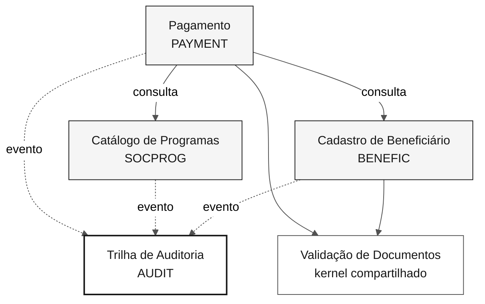

# Mapa de bounded contexts — SIFAP 2.0

> **Trilha:** [Kit do Time](../README.md) › [Estágio 2](README.md) › **Bounded contexts**

**Decisão de decomposição do SIFAP 2.0.** Avalia as cinco hipóteses de fatiamento do [`discovery-report.md`](../01-archaeology/discovery-report.md) e define os contextos delimitados do Monólito Modular.

| Campo | Valor |
|---|---|
| **Estágio** | Estágio 2 — Especificação |
| **Data** | 2026-09-10 |
| **Entrada** | [`discovery-report.md`](../01-archaeology/discovery-report.md), [`dependency-map.md`](../01-archaeology/dependency-map.md) |
| **Arquitetura-alvo** | Monólito Modular — uma aplicação Spring Boot, módulos internos com limites explícitos |

---

## Distinção fundamental: fatia de migração ≠ contexto delimitado

O Estágio 1 propôs cinco **fatias de migração**: unidades de trabalho ordenadas por dependência. Um contexto delimitado é outra coisa: uma fronteira de modelo de domínio.

As duas coisas não coincidem, e forçar a coincidência produziria contextos errados.

- Uma fatia pode entregar **parte** de um contexto. A Fatia 5 entrega a conciliação, que pertence ao contexto Pagamento.
- Uma fatia pode **não ser** um contexto. A Fatia 1 agrupa duas capacidades de naturezas diferentes.

Esta é a razão pela qual as hipóteses foram reavaliadas, e não simplesmente promovidas.

---

## Avaliação das hipóteses

### Hipótese 1: Fundações transversais — **REJEITADA como contexto único**

| Critério | Avaliação | Evidência |
|---|---|---|
| Coesão | **Baixa.** Agrupa duas capacidades sem relação de domínio: registrar eventos e validar documentos | `dependency-map.md`, arestas 10-18 |
| Acoplamento | Alto com todos os módulos, por natureza | `CCAUDIT` é `INCLUDE` em 7 programas; `SUBVALCP` tem 4 chamadores |
| Frequência de mudança | **Divergente.** A auditoria muda por norma; a validação de CPF muda por regra de documento | `CCAUDIT.NSC:6-7` contra `CCVALCPF.NSC:6-7` |

**Decisão:** dividida em dois destinos distintos. A trilha de auditoria vira contexto próprio, porque tem dados, invariantes e ciclo de vida próprios. A validação de documentos vira kernel compartilhado, porque é função pura sem estado.

### Hipótese 2: Cadastro de Beneficiário — **ACEITA**

| Critério | Avaliação | Evidência |
|---|---|---|
| Coesão | **Alta.** Beneficiário e dependentes formam um único agregado | `BENEFIC.ddm:87` — dependentes são grupo periódico do próprio beneficiário |
| Acoplamento | **Baixo na escrita.** 2 escritores para 9 leitores | `dependency-map.md`, arestas 45-60 |
| Frequência de mudança | Estável. Última alteração relevante no cadastro em 2015 | `CADBENEF.NSP:5-9` |

### Hipótese 3: Catálogo de Programas Sociais — **ACEITA**

| Critério | Avaliação | Evidência |
|---|---|---|
| Coesão | **Alta.** Dados de parametrização com escritor único | `dependency-map.md`, arestas 61-66 |
| Acoplamento | Baixo. Consumido apenas por leitura | `CADPROG` é o único escritor de `SOCPROG` |
| Frequência de mudança | **Distinta.** Muda por decreto de reajuste, não por operação | `SOCPROG.ddm:8-11` |

**Nota:** cerca de 45 registros. O tamanho pequeno não desqualifica o contexto — a propriedade exclusiva do dado e o ciclo de mudança próprio o justificam.

### Hipótese 4: Processamento de Folha — **ACEITA E AMPLIADA**

| Critério | Avaliação | Evidência |
|---|---|---|
| Coesão | Alta em torno do agregado Pagamento | `dependency-map.md`, arestas 67-83 |
| Acoplamento | Lê `BENEFIC` e `SOCPROG`; não os escreve | `BATCHPGT.NSP:250`, `:302` |
| Frequência de mudança | Muda com regra de benefício e com layout bancário | `CALCBENF.NSN:5-11` |

### Hipótese 5: Conciliação e Relatórios — **REJEITADA como contexto separado**

| Critério | Avaliação | Evidência |
|---|---|---|
| Coesão | Alta internamente, **mas sobre dado alheio** | `BATCHCON.NSP:206-227` atualiza `PAYMENT` |
| Acoplamento | **Compartilha o agregado Pagamento com a Folha** | Ambos escrevem `PAYMENT` |
| Frequência de mudança | Muda com layout CNAB, independente da regra de cálculo | `BATCHCON.NSP:6-9` |

**Decisão:** absorvida pelo contexto Pagamento. Dois módulos que escrevem a mesma tabela não são contextos distintos — seriam contextos com propriedade compartilhada de dados, o antipadrão que a decomposição existe para evitar.

A frequência de mudança divergente é real e fica registrada como ponto de reavaliação: se a conciliação passar a mudar em ritmo próprio, o caminho é extrair um submódulo com evento de domínio, não compartilhar tabela.

Os relatórios não formam contexto: cada um pertence ao contexto que detém o dado que ele lê.

---

## Bounded contexts finais

### Cadastro de Beneficiário

| Campo | Valor |
|---|---|
| **Responsabilidade** | Manter a identidade, os dados cadastrais e os dependentes do beneficiário |
| **Dados sob sua responsabilidade** | `BENEFIC` (FNR 150) — 4.201.884 registros |
| **Interface pública** | `BeneficiaryQuery` (consulta por CPF ou NIS), evento `BeneficiaryRegistered`, `BeneficiaryUpdated` |
| **Por que é um contexto próprio** | Único proprietário da identidade do beneficiário; nenhum outro módulo escreve `BENEFIC` |
| **Legado de origem** | `CADBENEF`, `CADDEPEN`, `VALBENEF`, `VALDOCS`, `CONSBENF` |

### Catálogo de Programas Sociais

| Campo | Valor |
|---|---|
| **Responsabilidade** | Manter os programas sociais, suas faixas de valor e seus critérios de elegibilidade |
| **Dados sob sua responsabilidade** | `SOCPROG` (FNR 151) — ~45 registros de parametrização |
| **Interface pública** | `SocialProgramQuery` (consulta por código), evento `SocialProgramRegistered` |
| **Por que é um contexto próprio** | Ciclo de mudança regulatório, não operacional; escritor único |
| **Legado de origem** | `CADPROG` |

### Pagamento

| Campo | Valor |
|---|---|
| **Responsabilidade** | Apurar elegibilidade, calcular o benefício, aplicar descontos, gerar remessa e conciliar retorno bancário |
| **Dados sob sua responsabilidade** | `PAYMENT` (FNR 152) — ~180.000.000 registros |
| **Interface pública** | `PaymentQuery` (consulta por CPF e período), evento `PaymentGenerated`, `PaymentReconciled` |
| **Por que é um contexto próprio** | Único proprietário do agregado Pagamento, da geração à liquidação |
| **Legado de origem** | `BATCHPGT`, `CALCBENF`, `VALELEG`, `CALCDSCT`, `CALCCORR`, `BATCHCON`, `BATCHREL`, `RELPGT` |

### Trilha de Auditoria

| Campo | Valor |
|---|---|
| **Responsabilidade** | Registrar de forma imutável os eventos de alteração e de acesso a dado pessoal |
| **Dados sob sua responsabilidade** | `AUDIT` (FNR 153) e os três arquivos históricos sem DDM — 417.884.120 registros |
| **Interface pública** | Consome eventos de domínio dos demais contextos; expõe `AuditQuery` para relatório |
| **Por que é um contexto próprio** | Invariantes exclusivas: registro imutável, retenção mínima de 10 anos, obrigação normativa `IN-TCU 63/2010` |
| **Legado de origem** | `CCAUDIT`, `RELAUDIT` |

> A auditoria **não** é kernel compartilhado. Kernel não tem dados nem regras de negócio próprias; este contexto tem as duas coisas, além de obrigação legal independente da dos módulos que a alimentam.

---

## Kernel compartilhado

### Validação de Documentos

| Campo | Valor |
|---|---|
| **Responsabilidade** | Validar CPF e NIS por módulo 11 |
| **Dados sob sua responsabilidade** | Nenhum. Função pura, sem estado e sem persistência |
| **Interface pública** | `DocumentValidator.validateCpf(String)`, `validateNis(String)` |
| **Por que é kernel e não contexto** | Não possui agregado, não escreve dados e não tem linguagem de domínio própria |
| **Legado de origem** | `CCVALCPF`, `SUBVALCP`, `SUBVALNI` |

O legado tem cinco implementações divergentes desta mesma função. A unificação está decidida no [ADR-0005](../docs/adr/0005-rotina-unica-validacao-cpf.md).

---

## Comunicação entre contextos

| De | Para | Mecanismo | Dados |
|---|---|---|---|
| Pagamento | Cadastro de Beneficiário | Interface `BeneficiaryQuery` | CPF, situação, renda, dependentes, região, data de nascimento |
| Pagamento | Catálogo de Programas Sociais | Interface `SocialProgramQuery` | Código, tipo, valor base, fator de ajuste, faixas etárias |
| Cadastro de Beneficiário | Trilha de Auditoria | Evento de domínio | Ação, entidade, CPF afetado, autor |
| Catálogo de Programas Sociais | Trilha de Auditoria | Evento de domínio | Ação, entidade, autor |
| Pagamento | Trilha de Auditoria | Evento de domínio | Ação, entidade, CPF afetado, ciclo |
| Todos | Validação de Documentos | Chamada direta ao kernel | Documento a validar |

**Por que eventos para a auditoria.** No legado, cada programa monta o registro e chama `PERFORM WRITE-AUDIT` — acoplamento direto que produziu a lacuna da regra 80: `CALCBENF` e `CALCDSCT` alteram dados e não incluem o copycode. Com evento de domínio, o contexto de origem apenas publica o fato; garantir o registro passa a ser responsabilidade da auditoria, não da disciplina de cada autor.



---

## Mapeamento entre fatias de migração e contextos

| Fatia | Entrega | Contexto afetado |
|---|---|---|
| 1 — Fundações | Kernel de validação + contexto Auditoria completo | Validação de Documentos, Trilha de Auditoria |
| 2 — Cadastro | Contexto Cadastro completo | Cadastro de Beneficiário |
| 3 — Catálogo | Contexto Catálogo completo | Catálogo de Programas Sociais |
| 4 — Folha | Geração, cálculo, descontos e correção | Pagamento (parcial) |
| 5 — Conciliação | Conciliação bancária e relatórios | Pagamento (conclusão) |

O contexto Pagamento é o único entregue em duas fatias. É consequência do seu tamanho, não de fronteira mal traçada.

---

## Estrutura de pacotes resultante

```text
backend/src/main/java/br/gov/sifap/
├── beneficiary/           # Cadastro de Beneficiário
├── socialprogram/         # Catálogo de Programas Sociais
├── payment/               # Pagamento
├── audit/                 # Trilha de Auditoria
├── shared/
│   ├── document/          # Kernel: validação de CPF e NIS
│   └── exception/         # Kernel: tratamento de erros
└── SifapApplication.java
```

Nenhum módulo importa classes internas de outro. O acesso entre contextos ocorre por interface pública ou evento de domínio.

---

## Definição de pronto

- [x] Cinco hipóteses avaliadas por coesão, acoplamento e frequência de mudança.
- [x] Duas rejeições documentadas com justificativa e evidência.
- [x] Quatro contextos nomeados, mais um kernel compartilhado.
- [x] Comunicação entre contextos definida com mecanismo explícito.
- [x] Diagrama Mermaid válido.

---

### Continue lendo

| Anterior | Próximo |
|---|---|
| [Relatório de Descoberta](../01-archaeology/discovery-report.md)<br/><sub>Entrada do Estágio 2.</sub> | [ADR-0003](../docs/adr/0003-preservacao-de-comportamento.md)<br/><sub>Política de preservação de comportamento.</sub> |

<sub>[Voltar ao índice do kit](../README.md)</sub>
