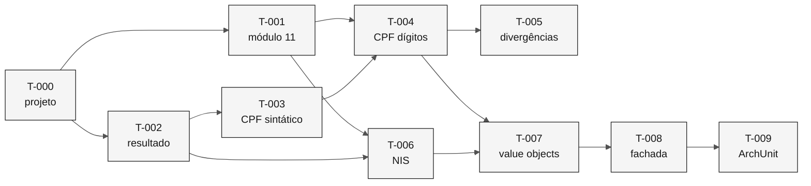

# Tarefas — Validação de Documentos

> **Especificação:** [`spec.md`](spec.md) · **Plano:** [`plan.md`](plan.md)

**Ordem de execução.** Cada tarefa entrega teste e implementação juntos, conforme a regra do repositório: testes durante a implementação, nunca depois.

| Campo | Valor |
|---|---|
| **Fatia** | 1 — Fundações transversais |
| **Módulo** | `backend/src/main/java/br/gov/sifap/shared/document/` |
| **Pré-requisito** | Projeto Spring Boot inicializado (`backend/` ainda não existe) |

---

## T-000 — Inicializar o projeto backend

Criar a estrutura Spring Boot 3.3 com Java 21, Maven e a configuração base.

- **Entrega:** `backend/pom.xml`, `SifapApplication.java`, `application.yml`
- **Verificação:** `mvn test` executa sem erro em projeto vazio
- **Bloqueia:** todas as demais tarefas
- **Nota:** o repositório ainda não tem `backend/`. Esta tarefa é pré-requisito de toda a Fatia 1.

---

## T-001 — Cálculo de módulo 11 compartilhado

Implementar `Modulo11Validator` no pacote `internal`, recebendo os pesos como parâmetro.

- **Requisitos:** apoia `REQ-DOC-003` e `REQ-DOC-005`
- **Testes:** dígito calculado para pesos de CPF e de NIS; resto menor que dois resulta em zero
- **Verificação:** teste parametrizado cobre resto `0`, `1` e maior que `1`
- **Depende de:** T-000

> A regra "resto menor que dois resulta em zero" aparece nas duas rotinas legadas (`CCVALCPF.NSC:101`, `SUBVALNI.NSN:144`). Centralizar aqui evita a duplicação que produziu as cinco variantes.

---

## T-002 — Motivos de falha e resultado tipado

Implementar `ValidationFailure` e `ValidationResult`.

- **Requisitos:** `REQ-DOC-004`, `REQ-DOC-007`
- **Testes:** resultado válido não carrega motivo; resultado inválido sempre carrega motivo
- **Verificação:** o enum cobre os quatro motivos da spec, sem valor genérico de reserva
- **Depende de:** T-000

---

## T-003 — Validação sintática de CPF

Verificação de comprimento, caracteres numéricos e dígitos repetidos.

- **Requisitos:** `REQ-DOC-001`, `REQ-DOC-002`, `REQ-DOC-004`
- **Testes:** os quatro casos sintáticos da tabela de vetores do plano
- **Verificação:** `00000000000` devolve `NAO_INFORMADO`, e não `DIGITOS_REPETIDOS`
- **Depende de:** T-002

> A distinção entre "não informado" e "dígitos repetidos" é exigência de `REQ-DOC-004`. O legado colapsa os dois em um único código.

---

## T-004 — Dígitos verificadores de CPF

Cálculo dos dois verificadores com os pesos de `CCVALCPF.NSC:92-128`.

- **Requisitos:** `REQ-DOC-003`
- **Testes:** CPF válido; primeiro DV incorreto; segundo DV incorreto
- **Verificação:** vetores do plano passam integralmente
- **Depende de:** T-001, T-003

---

## T-005 — Divergência deliberada contra o legado

Testes que documentam os pontos de nível `C`, com comentário explicando a diferença.

- **Requisitos:** `REQ-DOC-002`, `REQ-DOC-008`, `REQ-DOC-009`
- **Testes:** `111.111.111-11` recusado; CPF de prefixo `999` com DV errado recusado; sem exceção de teste governamental
- **Verificação:** cada teste cita o REQ-ID e o membro legado que se comporta de forma diferente
- **Depende de:** T-004

> Estes testes **falham contra o legado por design**. O comentário no teste é a documentação viva da decisão do [ADR-0005](../../docs/adr/0005-rotina-unica-validacao-cpf.md).

---

## T-006 — Validação de NIS

Verificação sintática e dígito verificador com os pesos de `SUBVALNI.NSN:43-44`.

- **Requisitos:** `REQ-DOC-005`, `REQ-DOC-006`
- **Testes:** NIS válido; verificador incorreto; zeros; caractere não numérico
- **Verificação:** os pesos `3,2,9,8,7,6,5,4,3,2` estão em constante nomeada, não literal espalhado
- **Depende de:** T-001, T-002

---

## T-007 — Value objects `Cpf` e `Nis`

Fábricas `of` e `tryParse`, com validação obrigatória na criação.

- **Requisitos:** `REQ-DOC-007`
- **Testes:** `of` lança exceção para documento inválido; `tryParse` devolve `Optional` vazio; instância criada é sempre válida
- **Verificação:** não existe construtor público nem setter
- **Depende de:** T-004, T-006

> É esta tarefa que elimina o antipadrão do legado. Depois dela, um método que recebe `Cpf` não precisa revalidar, e não existe caminho para documento não validado circular.

---

## T-008 — Interface pública do kernel

`DocumentValidator` como fachada, com implementação registrada como bean.

- **Requisitos:** `REQ-DOC-007`
- **Testes:** o validador não grava nada e não mantém estado entre chamadas
- **Verificação:** nenhuma classe fora de `shared.document` importa o pacote `internal`
- **Depende de:** T-007

---

## T-009 — Teste de arquitetura

Regra ArchUnit que impede acesso ao pacote `internal` a partir de outros módulos.

- **Requisitos:** apoia a fronteira definida no [mapa de contextos](../../02-modern-spec/bounded-contexts.md)
- **Testes:** regra falha se um módulo de domínio importar `shared.document.internal`
- **Verificação:** a regra roda no `mvn test`
- **Depende de:** T-008

> Sem esta regra, a fronteira entre módulos é convenção. Com ela, é verificada em cada build — que é o que separa monólito modular de monólito comum.

---

## Ordem e dependências

---

## Rastreabilidade de requisitos

| Requisito | Tarefas | Nível |
|---|---|---|
| `REQ-DOC-001` | T-003 | `P` |
| `REQ-DOC-002` | T-003, T-005 | `C` |
| `REQ-DOC-003` | T-001, T-004 | `P` |
| `REQ-DOC-004` | T-002, T-003 | `P` |
| `REQ-DOC-005` | T-001, T-006 | `P` |
| `REQ-DOC-006` | T-006 | `P` |
| `REQ-DOC-007` | T-002, T-007, T-008 | `P` |
| `REQ-DOC-008` | T-005 | `C` |
| `REQ-DOC-009` | T-005 | `C` |
| `REQ-DOC-010` | — adiado para a Fatia 2 | `C` |

Todo requisito da spec tem ao menos uma tarefa, exceto o `REQ-DOC-010`, cujo adiamento está justificado no [`plan.md`](plan.md).

---

## Definição de pronto

- [x] Toda tarefa entrega teste e implementação juntos.
- [x] Toda tarefa cita os requisitos que cobre.
- [x] Dependências entre tarefas explícitas.
- [x] Requisitos de nível `C` têm teste que documenta a divergência.
- [x] Nenhum requisito da spec ficou sem tarefa ou sem justificativa de adiamento.
