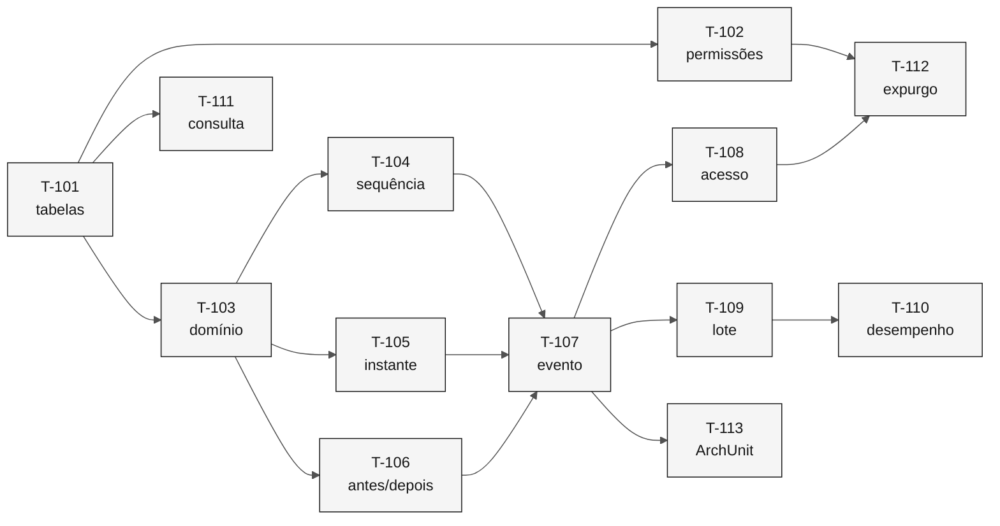

# Tarefas — Trilha de Auditoria

> **Especificação:** [`spec.md`](spec.md) · **Plano:** [`plan.md`](plan.md)

| Campo | Valor |
|---|---|
| **Fatia** | 1 — Fundações transversais |
| **Módulo** | `backend/src/main/java/br/gov/sifap/audit/` |
| **Pré-requisito** | `T-000` da [feature 001](../001-validacao-de-documentos/tasks.md) — projeto Spring Boot inicializado |

---

## T-101 — Migração das tabelas particionadas

Criar `audit_change_event` e `audit_access_event` com partição por range mensal e índices.

- **Requisitos:** `REQ-AUD-012`
- **Testes:** migração aplica em base limpa; partição do mês corrente existe
- **Verificação:** `EXPLAIN` de consulta por entidade e período usa índice
- **Depende de:** projeto inicializado

---

## T-102 — Permissões de imutabilidade

Revogar `UPDATE` e `DELETE` da role da aplicação; criar role de expurgo com permissão restrita.

- **Requisitos:** `REQ-AUD-002`
- **Testes:** tentativa de `UPDATE` falha; tentativa de `DELETE` falha; leitura permanece permitida
- **Verificação:** o teste roda contra PostgreSQL real via Testcontainers
- **Depende de:** T-101

> A invariante pertence ao banco, não à aplicação. Convenção que depende de disciplina foi o que permitiu cinco rotinas de CPF divergentes conviverem por 14 anos.

---

## T-103 — Modelo de domínio do evento

Entidades `AuditChangeEvent` e `AuditAccessEvent`, com enum `AuditAction` e value object `Actor`.

- **Requisitos:** `REQ-AUD-005`, `REQ-AUD-008`
- **Testes:** evento exige autor e perfil; ação usa o domínio novo, não os códigos legados
- **Verificação:** não existe setter público; o evento é imutável também em memória
- **Depende de:** T-101

---

## T-104 — Numeração por sequência

Chave gerada por `BIGSERIAL`, sem leitura prévia do maior valor.

- **Requisitos:** `REQ-AUD-003`
- **Testes:** teste concorrente com múltiplas threads registrando eventos simultaneamente
- **Verificação:** nenhuma colisão em 1.000 inserções concorrentes
- **Depende de:** T-103

> O teste concorrente é o ponto: a técnica legada passa em teste sequencial e falha com duas sessões.

---

## T-105 — Carimbo de tempo com precisão de milissegundos

Registro do instante em `TIMESTAMPTZ`, sem truncamento.

- **Requisitos:** `REQ-AUD-004`
- **Testes:** dois eventos gravados no mesmo segundo têm ordem determinística
- **Verificação:** o instante gravado preserva a precisão de origem
- **Depende de:** T-103

---

## T-106 — Registro de valores anterior e posterior

Serialização do conjunto de mudanças em `JSONB`.

- **Requisitos:** `REQ-AUD-006`
- **Testes:** alteração de um campo produz par anterior/posterior; inclusão não produz valor anterior; alteração de vários campos produz um par por campo
- **Verificação:** consulta por campo alterado funciona via operador JSON
- **Depende de:** T-103

---

## T-107 — Publicação e consumo de evento de domínio

`AuditEventListener` com `@TransactionalEventListener(BEFORE_COMMIT)`.

- **Requisitos:** `REQ-AUD-001`
- **Testes:** transação confirmada grava o evento; transação desfeita **não** deixa evento órfão
- **Verificação:** o teste de rollback é obrigatório e falha se o listener for assíncrono
- **Depende de:** T-104, T-105, T-106

> O teste de rollback é o que preserva o comportamento do legado, em que o `BACKOUT` desfaz dado e auditoria juntos. Sem ele, uma mudança futura para listener assíncrono passaria despercebida.

---

## T-108 — Registro de acesso a dado pessoal

Consumo de evento de consulta, com gravação em `audit_access_event`.

- **Requisitos:** `REQ-AUD-007`
- **Testes:** consulta por CPF gera evento de acesso; o evento vai para a tabela de acesso, não para a de alteração
- **Verificação:** política de retenção é configurável e independente da de alteração
- **Depende de:** T-107

---

## T-109 — Contexto de execução em lote

Registro do identificador da execução e sua situação em eventos de processamento.

- **Requisitos:** `REQ-AUD-009`, `REQ-AUD-010`
- **Testes:** ciclo com N operações produz N eventos mais um de conclusão
- **Verificação:** um pagamento individual é rastreável até o autor e o instante
- **Depende de:** T-107

> Corrige a regra 129: hoje 3,8 milhões de pagamentos por ciclo produzem um único registro de auditoria.

---

## T-110 — Inserção em lote para processamento

Otimização da gravação em cenário de alto volume.

- **Requisitos:** apoia `REQ-AUD-010`
- **Testes:** teste de carga com 100 mil eventos dentro de uma janela definida
- **Verificação:** o tempo de gravação não inviabiliza a janela batch de 4 horas
- **Depende de:** T-109

> Risco identificado no plano. A Fatia 4 gera 3,8 milhões de eventos por ciclo; medir aqui evita descobrir o problema na folha.

---

## T-111 — Interface de consulta

`AuditQuery` com filtro por entidade, identificador e intervalo de datas.

- **Requisitos:** `REQ-AUD-012`
- **Testes:** consulta por CPF e período retorna os eventos corretos
- **Verificação:** `EXPLAIN` confirma uso de índice, não varredura sequencial
- **Depende de:** T-101, T-103

---

## T-112 — Expurgo por retenção

Rotina de `DROP PARTITION` para partições fora do prazo, com prazos distintos por tabela.

- **Requisitos:** `REQ-AUD-013`, apoia `REQ-AUD-007`
- **Testes:** partição de alteração com menos de 10 anos é preservada; partição de acesso fora do prazo configurado é removida
- **Verificação:** o expurgo usa a role restrita, não a da aplicação
- **Depende de:** T-102, T-108

---

## T-113 — Teste de arquitetura

Regra ArchUnit: nenhum módulo de domínio importa classes internas de `audit`; a comunicação ocorre apenas por evento.

- **Requisitos:** apoia a fronteira do [mapa de contextos](../../02-modern-spec/bounded-contexts.md)
- **Testes:** a regra falha se um módulo chamar o repositório de auditoria diretamente
- **Verificação:** roda no `mvn test`
- **Depende de:** T-107

---

## Ordem e dependências

---

## Rastreabilidade de requisitos

| Requisito | Tarefas | Nível |
|---|---|---|
| `REQ-AUD-001` | T-107 | `P` |
| `REQ-AUD-002` | T-102 | `P` |
| `REQ-AUD-003` | T-104 | `C` |
| `REQ-AUD-004` | T-105 | `C` |
| `REQ-AUD-005` | T-103 | `C` |
| `REQ-AUD-006` | T-106 | `C` |
| `REQ-AUD-007` | T-108, T-112 | `C` |
| `REQ-AUD-008` | T-103 | `C` |
| `REQ-AUD-009` | T-109 | `P` |
| `REQ-AUD-010` | T-109, T-110 | `C` |
| `REQ-AUD-011` | — implementado na Fatia 5, junto do relatório | `C` |
| `REQ-AUD-012` | T-101, T-111 | `P` |
| `REQ-AUD-013` | T-112 | `P` |

Todo requisito tem tarefa, exceto o `REQ-AUD-011`, cujo adiamento está justificado no [`plan.md`](plan.md).

---

## Definição de pronto

- [x] Toda tarefa entrega teste e implementação juntos.
- [x] Toda tarefa cita os requisitos que cobre.
- [x] Dependências entre tarefas explícitas.
- [x] Invariantes críticas verificadas contra banco real, não simulado.
- [x] Nenhum requisito ficou sem tarefa ou sem justificativa de adiamento.
