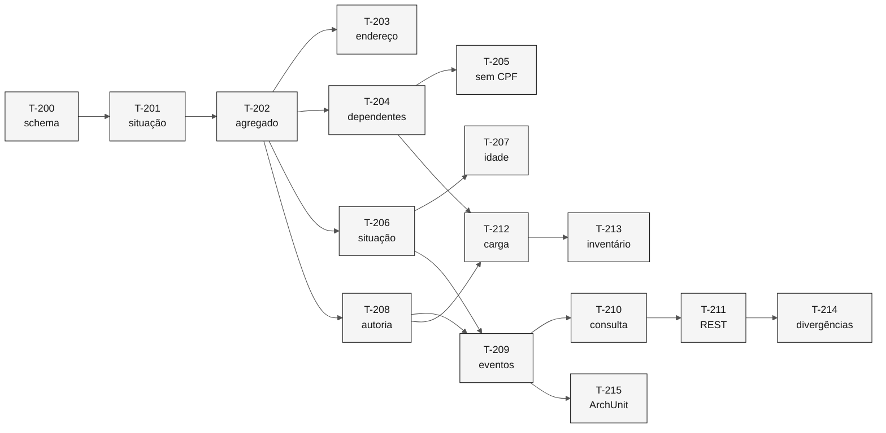

# Tarefas — Cadastro de Beneficiário

> **Especificação:** [`spec.md`](spec.md) · **Plano:** [`plan.md`](plan.md)

**Ordem de execução.** Cada tarefa entrega teste e implementação juntos, conforme a regra do repositório: testes durante a implementação, nunca depois.

| Campo | Valor |
|---|---|
| **Fatia** | 2 — Cadastro |
| **Módulo** | `backend/src/main/java/br/gov/sifap/beneficiary/` |
| **Pré-requisito** | Fatia 1 concluída: kernel `shared/document` e contexto `audit` em uso |

---

## T-200 — Schema do cadastro

Migração com `beneficiary`, `dependent` e `beneficiary_migration_issue`, com restrições de domínio e índices.

- **Requisitos:** `REQ-BEN-001`, `REQ-BEN-004`, `REQ-BEN-010`, `REQ-BEN-011`, `REQ-BEN-012`
- **Testes:** migração aplica em base limpa; CPF duplicado é recusado pelo banco; situação fora do domínio é recusada
- **Verificação:** dois dependentes sem CPF no mesmo titular convivem; com o mesmo CPF, não
- **Depende de:** projeto inicializado

> A unicidade parcial faz o trabalho de duas regras ao mesmo tempo. Em PostgreSQL, `NULL` não colide com `NULL`, e por isso o `REQ-BEN-011` e o `REQ-BEN-012` cabem numa única restrição.

---

## T-201 — Situação cadastral como tipo

`BeneficiaryStatus` público e `DependentStatus`, com o domínio do dicionário.

- **Requisitos:** `REQ-BEN-004`
- **Testes:** o enum cobre exatamente `A`, `S`, `C`, `I` e `D`; conversão do código legado é total
- **Verificação:** não existe valor de reserva nem `PENDENTE`
- **Depende de:** T-200

> A ausência de `PENDENTE` é deliberada. Sinalização de carga vive em tabela própria, para não contaminar o domínio que a Fatia 4 vai consumir.

---

## T-202 — Agregado com validação na construção

`Beneficiary` como raiz, criada apenas por fábrica que valida documentos, nome, data de nascimento e sexo.

- **Requisitos:** `REQ-BEN-002`, `REQ-BEN-003`
- **Testes:** documento inválido impede a construção; nome ausente impede; sexo fora do domínio impede
- **Verificação:** não existe construtor público nem setter; a validação de CPF ocorre uma única vez
- **Depende de:** T-201

> É a mesma técnica dos value objects da Fatia 1. Um `Beneficiary` que existe é válido, e por isso o `AC-003.3` — não validar duas vezes — não precisa de código para ser satisfeito.

---

## T-203 — Endereço sem perda

`Address` como `@Embeddable`, com a estrutura do dicionário.

- **Requisitos:** `REQ-BEN-018`
- **Testes:** logradouro de 120 caracteres volta íntegro da base
- **Verificação:** nenhum campo capturado deixa de ter destino de gravação
- **Depende de:** T-202

---

## T-204 — Dependentes dentro do agregado

Limite de ativos, contagem derivada, duplicidade e validação de documento.

- **Requisitos:** `REQ-BEN-008`, `REQ-BEN-009`, `REQ-BEN-012`, `REQ-BEN-013`, `REQ-BEN-014`
- **Testes:** aceita o sexto dependente e recusa o sétimo; inativar reduz a contagem; CPF duplicado recusado; CPF inválido recusado; titular cancelado recusado, suspenso aceito
- **Verificação:** não existe campo de contagem armazenado
- **Depende de:** T-202

> O limite legado é `IF #NUM-DEPEND > 5`, que aceita o sexto. O teste de borda precisa cobrir cinco, seis e sete, senão a divergência com a `RN-004` passa despercebida.

---

## T-205 — Dependente sem documento

Ausência de CPF representada como ausência, não como onze zeros.

- **Requisitos:** `REQ-BEN-011`
- **Testes:** dois dependentes sem CPF no mesmo titular são aceitos; a validação não é aplicada a eles
- **Verificação:** o valor `00000000000` não aparece em nenhuma linha gravada
- **Depende de:** T-204

---

## T-206 — Situação fora do comando de alteração

`UpdateBeneficiaryCommand` sem campo de situação; `ChangeBeneficiaryStatusCommand` com motivo obrigatório.

- **Requisitos:** `REQ-BEN-005`, `REQ-BEN-006`
- **Testes:** alteração cadastral preserva a situação; beneficiário suspenso permanece suspenso após alterar endereço; mudança de situação exige motivo
- **Verificação:** não existe caminho para gravar situação por alteração cadastral
- **Depende de:** T-202

> Este é o teste central da fatia. `CADBENEF.NSP:314` grava branco, e `VALELEG.NSN:133-151` trata branco como elegível — alterar o endereço de um suspenso o reativa. Ver [ADR-0006](../../docs/adr/0006-situacao-cadastral-do-beneficiario.md).

---

## T-207 — Idade e suspensão automática

Cálculo por diferença de anos civis, preservado, com evento de mudança de situação.

- **Requisitos:** `REQ-BEN-007`, `REQ-BEN-006`
- **Testes:** nascido em dezembro tem a mesma idade do legado quando apurado em janeiro; suspensão acima de 75 anos gera evento com motivo
- **Verificação:** o evento carrega data de nascimento e idade apurada
- **Depende de:** T-206

> Preservado por decisão, não por descuido. O cálculo ignora mês e dia, com margem de até onze meses, mas altera quem é suspenso — e portanto quem recebe. O `ADR-0003` não autoriza corrigir isso.

---

## T-208 — Autoria, instante e concorrência

Campos de criação e alteração preenchidos a partir do `Actor`; `@Version` no agregado.

- **Requisitos:** `REQ-BEN-019`
- **Testes:** inclusão registra autor e instante; alteração registra os dois; alteração concorrente sobre a mesma versão falha
- **Verificação:** nenhum registro é gravado sem autor
- **Depende de:** T-202

> Os campos existem em `BENEFIC.ddm:112-118` desde 1997, inclusive o de controle de concorrência, e nenhum programa os preenche. O `CADBENEF` faz `FIND` e `UPDATE` sem proteção.

---

## T-209 — Eventos de domínio

Os cinco eventos do catálogo, implementando `AuditableEvent`.

- **Requisitos:** apoia `REQ-AUD-001` e `REQ-AUD-006`
- **Testes:** cada operação publica seu evento; alteração carrega os campos modificados com valor anterior e posterior; transação desfeita não deixa evento
- **Verificação:** nenhuma classe do contexto importa o pacote `audit`
- **Depende de:** T-206, T-208

> O consumidor já existe e está testado desde a `T-107`. Esta tarefa confirma o catálogo provisório de [`domain-events.md`](../../02-modern-spec/domain-events.md) e é o primeiro uso real do contrato por um publicador.

---

## T-210 — Consulta com registro de acesso

`BeneficiaryQuery` por CPF e por NIS, com `Actor` obrigatório e documento mascarado na projeção.

- **Requisitos:** `REQ-BEN-015`, `REQ-BEN-016`, `REQ-BEN-017`
- **Testes:** consulta por CPF e por NIS; consulta gera evento na trilha de acesso e não na de alteração; documento devolvido mascarado
- **Verificação:** não existe sobrecarga de consulta sem `Actor`
- **Depende de:** T-202, T-209

> O `Actor` está na assinatura de propósito. Se fosse opcional, registrar o acesso voltaria a depender da lembrança de quem chama, que é o padrão que a Fatia 1 eliminou.

---

## T-211 — API REST do cadastro

Endpoints de inclusão, alteração, mudança de situação, inclusão de dependente e consulta.

- **Requisitos:** `REQ-BEN-001` a `REQ-BEN-018`
- **Testes:** cada endpoint com caso válido e caso recusado; erro de validação devolve motivo específico
- **Verificação:** os paths seguem `/api/v1/beneficiaries`; nenhuma entidade JPA aparece na resposta
- **Depende de:** T-210

---

## T-212 — Carga inicial com sinalização

Leitor do arquivo de extração posicional, com inserção em lote e registro de pendências.

- **Requisitos:** `REQ-BEN-020`
- **Testes:** registro com CPF inválido é migrado com pendência; registro com situação em branco é migrado com situação nula e pendência; nenhum registro é descartado
- **Verificação:** a contagem de entrada é igual à de saída, sempre
- **Depende de:** T-204, T-208

> [!WARNING]
> O teste de que nenhum registro é descartado é obrigatório. Decidir o destino de um beneficiário com documento inválido é competência de negócio, e uma carga que descarta remove a possibilidade da decisão.

---

## T-213 — Inventário de domínio na carga

Relatório de valores encontrados fora do domínio declarado, com contagem.

- **Requisitos:** `REQ-BEN-021`
- **Testes:** valor de parentesco fora do domínio produz linha de inventário; o registro é migrado, não recusado
- **Verificação:** o relatório traz cada valor distinto com sua contagem
- **Depende de:** T-212

> O dicionário declara `FI`, `CJ`, `NT`, `TU` e o `CADDEPEN.NSP:152` aceita `FI`, `CO`, `IR`, `OU`. Só `FI` coincide. Não dá para escolher o domínio do sistema novo sem saber o que existe nos 4,2 milhões de registros.

---

## T-214 — Divergências deliberadas

Testes que documentam os dez requisitos de nível `C`, cada um citando o membro legado divergente.

- **Requisitos:** `REQ-BEN-003`, `005`, `009`, `010`, `012`, `013`, `018`, `019`, `020`, `021`
- **Testes:** um por requisito, com comentário que aponta `arquivo:linha` do comportamento não reproduzido
- **Verificação:** cada teste falha contra o legado por design
- **Depende de:** T-211

---

## T-215 — Teste de arquitetura

Regras ArchUnit para a fronteira do contexto `beneficiary`.

- **Requisitos:** apoia a fronteira do [mapa de contextos](../../02-modern-spec/bounded-contexts.md)
- **Testes:** nenhum módulo alcança `beneficiary.internal`; o contexto não importa `audit` nem `payment`
- **Verificação:** roda no `mvn test`
- **Depende de:** T-209

---

## Ordem e dependências

---

## Rastreabilidade de requisitos

| Requisito | Tarefas | Nível |
|---|---|---|
| `REQ-BEN-001` | T-200, T-211 | `P` |
| `REQ-BEN-002` | T-202 | `P` |
| `REQ-BEN-003` | T-202, T-214 | `C` |
| `REQ-BEN-004` | T-200, T-201 | `C` |
| `REQ-BEN-005` | T-206, T-214 | `C` |
| `REQ-BEN-006` | T-206, T-207, T-209 | `PS` |
| `REQ-BEN-007` | T-207 | `PS` |
| `REQ-BEN-008` | T-204 | `PS` |
| `REQ-BEN-009` | T-204, T-214 | `C` |
| `REQ-BEN-010` | T-200, T-214 | `C` |
| `REQ-BEN-011` | T-200, T-205 | `P` |
| `REQ-BEN-012` | T-200, T-204, T-214 | `C` |
| `REQ-BEN-013` | T-204, T-214 | `C` |
| `REQ-BEN-014` | T-204 | `P` |
| `REQ-BEN-015` | T-210, T-211 | `P` |
| `REQ-BEN-016` | T-210 | `P` |
| `REQ-BEN-017` | T-210 | `P` |
| `REQ-BEN-018` | T-203, T-214 | `C` |
| `REQ-BEN-019` | T-208, T-214 | `C` |
| `REQ-BEN-020` | T-212, T-214 | `C` |
| `REQ-BEN-021` | T-213, T-214 | `C` |

Todo requisito da spec tem ao menos uma tarefa. Nenhum foi adiado.

---

## Definição de pronto

- [x] Toda tarefa entrega teste e implementação juntos.
- [x] Toda tarefa cita os requisitos que cobre.
- [x] Dependências entre tarefas explícitas.
- [x] Requisitos de nível `C` têm teste que documenta a divergência.
- [x] Nenhum requisito da spec ficou sem tarefa.
