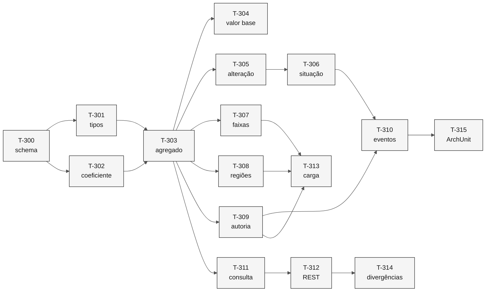

# Tarefas — Catálogo de Programas Sociais

> **Especificação:** [`spec.md`](spec.md) · **Plano:** [`plan.md`](plan.md)

**Ordem de execução.** Cada tarefa entrega teste e implementação juntos, conforme a regra do repositório: testes durante a implementação, nunca depois.

| Campo | Valor |
|---|---|
| **Fatia** | 3 — Catálogo |
| **Módulo** | `backend/src/main/java/br/gov/sifap/socialprogram/` |
| **Pré-requisito** | Fatias 1 e 2 concluídas: kernel, trilha de auditoria e contrato de eventos em uso |

---

## T-300 — Schema do catálogo

Migração com `social_program`, `calculation_band`, `regional_parameter` e `adjustment_coefficient`.

- **Requisitos:** `REQ-PRG-001`, `REQ-PRG-002`, `REQ-PRG-003`, `REQ-PRG-007`, `REQ-PRG-011`
- **Testes:** código duplicado recusado; tipo e situação fora do domínio recusados; valor base zero recusado; encerrado sem data recusado
- **Verificação:** faixa `0–0` é aceita e faixa `65–18` é recusada pela mesma restrição
- **Depende de:** projeto inicializado

> `ck_program_age_range` precisa admitir zero nos dois lados. Zero significa ausência de limite (`SOCPROG.ddm:57-58`), e confundir isso com faixa invertida tornaria todo programa sem limite etário inválido.

---

## T-301 — Tipos de domínio

`SocialProgramStatus`, `SocialProgramType` e conversão dos códigos legados.

- **Requisitos:** `REQ-PRG-002`, `REQ-PRG-008`
- **Testes:** conversão de `A`, `T` e `P` para tipo; de `A`, `I` e `E` para situação; código desconhecido devolve vazio
- **Verificação:** os enums cobrem exatamente o domínio do dicionário, sem valor de reserva
- **Depende de:** T-300

---

## T-302 — Coeficiente do fator de ajuste

`AdjustmentCoefficient` com vigência e origem declarada.

- **Requisitos:** `REQ-PRG-005`
- **Testes:** o coeficiente vigente em uma data é único; o fator derivado reproduz `CADPROG.NSP:124`
- **Verificação:** o registro inicial declara a origem como desconhecida, citando o `SIFAP-M-04`
- **Depende de:** T-300

> A tabela existe para que o valor seja questionável. Uma constante em `static final` seria mais simples e reproduziria exatamente o defeito: número sem origem, escondido no código.

---

## T-303 — Agregado com validação na construção

`SocialProgram` como raiz, criada apenas por fábrica que valida nome, tipo, valor base e faixa etária.

- **Requisitos:** `REQ-PRG-002`, `REQ-PRG-003`, `REQ-PRG-008`
- **Testes:** cada parâmetro inválido impede a construção; situação inicial é ativa
- **Verificação:** não existe construtor público nem setter
- **Depende de:** T-302

---

## T-304 — Valor base preservado

Gravação do valor informado, com o fator de ajuste em campo próprio.

- **Requisitos:** `REQ-PRG-004`
- **Testes:** valor informado é o valor gravado; o fator derivado é calculado sob demanda, não persistido
- **Verificação:** o valor lido do banco coincide com o informado na inclusão
- **Depende de:** T-303

> `CADPROG.NSP:125` calcula `#AMT-CALC` e `:130` grava esse resultado no campo de valor base. Quem consulta vê um número que ninguém digitou.

---

## T-305 — Alteração de programa

`UpdateSocialProgramCommand`, com os campos alteráveis e sem situação.

- **Requisitos:** `REQ-PRG-006`
- **Testes:** alteração grava e devolve os campos modificados; alteração não toca a situação
- **Verificação:** o comando não possui campo de situação, como na Fatia 2
- **Depende de:** T-303

> Operação que o legado não tem. Um catálogo de parametrização sem alteração não comporta reajuste anual, que é a razão de ele existir.

---

## T-306 — Situação com transição verificada

Inativação e encerramento, com motivo e data.

- **Requisitos:** `REQ-PRG-007`
- **Testes:** ativo vai a inativo e a encerrado; inativo volta a ativo; encerrado recusa qualquer transição
- **Verificação:** encerrar sem data de encerramento é impossível, garantido pelo banco
- **Depende de:** T-305

> Diferente do beneficiário, aqui há fonte para a máquina de estados: `SOCPROG.ddm:36` declara `DT-CLOSURE` com `0=ACTIVE`, o que estabelece encerrado como terminal.

---

## T-307 — Faixas de cálculo

`CalculationBand`, substituídas em bloco, com invariante de não sobreposição.

- **Requisitos:** `REQ-PRG-010`
- **Testes:** faixas contíguas aceitas; faixas sobrepostas recusadas; faixa aberta no topo aceita
- **Verificação:** a invariante é do agregado, não do banco — sobreposição exige comparar pares
- **Depende de:** T-303

> `CALCBENF.NSN:129-137` carrega cinco fatores de faixa por `MOVE` no fonte. A estrutura está no dicionário desde 1997, vazia.

---

## T-308 — Parâmetros regionais

`RegionalParameter` por código de região, substituídos em bloco.

- **Requisitos:** `REQ-PRG-011`
- **Testes:** região fora do domínio recusada; região repetida no mesmo programa recusada
- **Verificação:** o domínio aceito é `01`–`05` e `99`, conforme o dicionário
- **Depende de:** T-303

---

## T-309 — Autoria, instante e concorrência

Campos de criação e alteração a partir do `Actor`; `@Version` no agregado.

- **Requisitos:** `REQ-PRG-013`
- **Testes:** inclusão e alteração registram autor e instante; alteração concorrente falha
- **Verificação:** nenhum registro é gravado sem autor
- **Depende de:** T-303

> `SOCPROG.ddm:95-98` declara os quatro campos de controle desde 1997 e nenhum programa os preenche.

---

## T-310 — Eventos de domínio

`SocialProgramRegistered`, `SocialProgramUpdated` e `SocialProgramStatusChanged`.

- **Requisitos:** `REQ-PRG-014`, apoia `REQ-AUD-001` e `REQ-AUD-006`
- **Testes:** cada operação publica seu evento; nenhum evento carrega CPF afetado; transação desfeita não deixa evento
- **Verificação:** os dois eventos novos são acrescentados ao catálogo de eventos de domínio
- **Depende de:** T-306, T-309

> Primeiro contexto cujos eventos não têm sujeito pessoal. A trilha já comporta: `subjectCpf()` é `Optional` desde a Fatia 1, e `CADPROG.NSP:144` faz `RESET #AUD-CPF`.

---

## T-311 — Interface de consulta

`SocialProgramQuery`, com projeção enxuta para o cálculo e projeção completa para administração.

- **Requisitos:** `REQ-PRG-009`, `REQ-PRG-012`
- **Testes:** a projeção do cálculo traz os sete campos lidos por `VALELEG` e `CALCBENF`; consulta por situação filtra corretamente
- **Verificação:** consulta a programa **não** publica evento de acesso
- **Depende de:** T-303

> As 45 linhas são parametrização, sem dado pessoal. Auditar essa leitura repetiria o problema de volume que motivou a `PORT. CGTI 213/2010`.

---

## T-312 — API REST

Endpoints de inclusão, alteração, situação, faixas, regiões e consulta.

- **Requisitos:** `REQ-PRG-001` a `REQ-PRG-012`
- **Testes:** cada endpoint com caso válido e recusado; erro devolve o REQ-ID
- **Verificação:** faixas e regiões são substituídas em bloco, nunca item a item
- **Depende de:** T-311

---

## T-313 — Carga inicial com inventário

Leitor da extração de `SOCPROG`, com sinalização e relatório de parametrização preenchida.

- **Requisitos:** `REQ-PRG-015`
- **Testes:** carga sem faixas produz inventário com contagem zero; programa com fator de ajuste diferente de zero é sinalizado; nenhum programa é descartado
- **Verificação:** o relatório informa quantos programas têm faixas, regiões e fator de correção preenchidos
- **Depende de:** T-307, T-308, T-309

> [!WARNING]
> Nenhum valor base é recalculado pela carga. Reverter o ajuste exigiria o coeficiente vigente na data de cada inclusão, que não é registrada, e alterar valor base altera benefício pago.

---

## T-314 — Divergências deliberadas

Testes que documentam os dez requisitos de nível `C`, cada um citando o membro legado divergente.

- **Requisitos:** `REQ-PRG-002`, `003`, `004`, `006`, `007`, `010`, `011`, `013`, `015`
- **Testes:** um por requisito, com comentário apontando `arquivo:linha`
- **Verificação:** cada teste falha contra o legado por design
- **Depende de:** T-312

---

## T-315 — Teste de arquitetura

Regras ArchUnit para a fronteira do contexto `socialprogram`.

- **Requisitos:** apoia a fronteira do [mapa de contextos](../../02-modern-spec/bounded-contexts.md)
- **Testes:** nenhum módulo alcança `socialprogram.internal`; o contexto não importa `audit`, `beneficiary` nem `payment`
- **Verificação:** roda no `mvn test`
- **Depende de:** T-310

---

## Ordem e dependências

---

## Rastreabilidade de requisitos

| Requisito | Tarefas | Nível |
|---|---|---|
| `REQ-PRG-001` | T-300, T-312 | `P` |
| `REQ-PRG-002` | T-300, T-301, T-303, T-314 | `C` |
| `REQ-PRG-003` | T-300, T-303, T-314 | `C` |
| `REQ-PRG-004` | T-304, T-314 | `C` |
| `REQ-PRG-005` | T-302 | `P` |
| `REQ-PRG-006` | T-305, T-314 | `C` |
| `REQ-PRG-007` | T-300, T-306, T-314 | `C` |
| `REQ-PRG-008` | T-301, T-303 | `P` |
| `REQ-PRG-009` | T-311 | `P` |
| `REQ-PRG-010` | T-307, T-314 | `C` |
| `REQ-PRG-011` | T-300, T-308, T-314 | `C` |
| `REQ-PRG-012` | T-311, T-312 | `P` |
| `REQ-PRG-013` | T-309, T-314 | `C` |
| `REQ-PRG-014` | T-310 | `P` |
| `REQ-PRG-015` | T-313, T-314 | `C` |

Todo requisito da spec tem ao menos uma tarefa. Nenhum foi adiado.

---

## Definição de pronto

- [x] Toda tarefa entrega teste e implementação juntos.
- [x] Toda tarefa cita os requisitos que cobre.
- [x] Dependências entre tarefas explícitas.
- [x] Requisitos de nível `C` têm teste que documenta a divergência.
- [x] Nenhum requisito da spec ficou sem tarefa.
