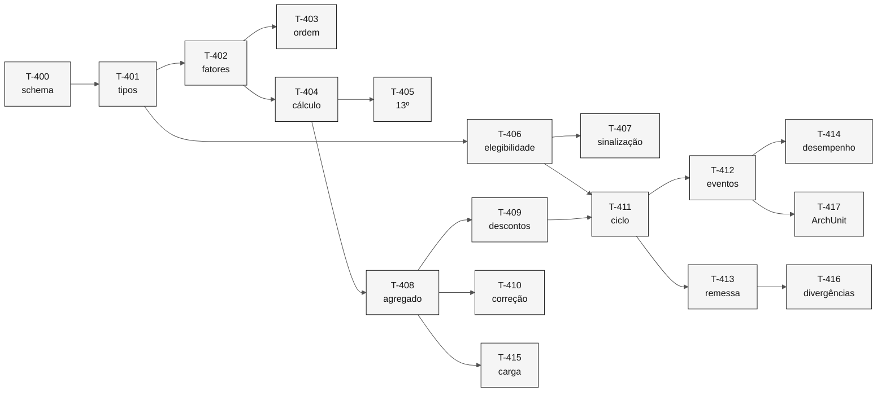

# Tarefas — Processamento de Folha

> **Especificação:** [`spec.md`](spec.md) · **Plano:** [`plan.md`](plan.md)

**Ordem de execução.** Cada tarefa entrega teste e implementação juntos, conforme a regra do repositório: testes durante a implementação, nunca depois.

| Campo | Valor |
|---|---|
| **Fatia** | 4 — Folha |
| **Módulo** | `backend/src/main/java/br/gov/sifap/payment/` |
| **Pré-requisito** | Fatias 1, 2 e 3 concluídas: kernel, trilha, cadastro e catálogo em uso |

---

## T-400 — Schema do pagamento

Migração com `payment`, `payment_discount` e `correction_index`, particionada por período.

- **Requisitos:** `REQ-PAY-001`, `REQ-PAY-002`, `REQ-PAY-016`, `REQ-PAY-018`, `REQ-PAY-020`
- **Testes:** segundo pagamento no mesmo período é recusado; tipo fora do domínio é recusado; líquido inconsistente é recusado
- **Verificação:** a partição do período corrente existe e a consulta por CPF e período usa índice
- **Depende de:** projeto inicializado

> Três restrições carregam requisitos inteiros. `uq_payment_cpf_period` é o `REQ-PAY-001`; `ck_payment_net_consistent` torna impossível o defeito do `CALCDSCT`; `ck_payment_type` recusa o `D` que `CALCBENF.NSN:273` grava.

---

## T-401 — Tipos de domínio do pagamento

`PaymentStatus`, `PaymentType` e `DiscountType`, com conversão dos códigos legados.

- **Requisitos:** `REQ-PAY-016`, `REQ-PAY-018`
- **Testes:** os oito tipos de desconto do dicionário convertem; código desconhecido devolve vazio
- **Verificação:** `DiscountType` cobre `IR`, `JD`, `CS`, `PA`, `EM`, `TX`, `OU` e `EX`
- **Depende de:** T-400

> O legado move um campo `A 3` para uma variável `A 1` e compara com cinco letras. `JD`, `PA` e `IR` funcionam por truncamento acidental; `CS`, `EM`, `TX`, `OU` e `EX` caem em `NONE → IGNORE`.

---

## T-402 — Fatores de cálculo isolados

`RegionalFactor`, `FamilyFactor`, `IncomeFactor`, `AgeFactor`, cada um em componente próprio.

- **Requisitos:** `REQ-PAY-011`, `REQ-PAY-012`
- **Testes:** cada fator com seus vetores; `IncomeFactor` é função total
- **Verificação:** nenhum fator guarda estado entre chamadas
- **Depende de:** T-401

> Isolar é o que torna a reversão localizada. Se a validação humana derrubar o `SIFAP-M-11`, muda `IncomeFactor` e nada mais.

---

## T-403 — Independência da ordem de processamento

Teste de propriedade: os mesmos insumos produzem o mesmo resultado.

- **Requisitos:** `REQ-PAY-012`
- **Testes:** dois beneficiários idênticos processados em ordens diferentes produzem valores idênticos; renda acima da última faixa falha com motivo
- **Verificação:** nenhum campo de instância nos componentes de cálculo
- **Depende de:** T-402

> [!WARNING]
> É o defeito mais grave encontrado no projeto. No `BATCHPGT`, `#FACTOR-INCOME` mantém o valor do beneficiário anterior quando nenhuma faixa cobre a renda. Dois beneficiários iguais recebem valores diferentes conforme a ordem de leitura do arquivo.

---

## T-404 — Cálculo do benefício

`BenefitCalculator` como função pura, devolvendo o resultado com os fatores aplicados.

- **Requisitos:** `REQ-PAY-010`, `REQ-PAY-013`, `REQ-PAY-014`
- **Testes:** vetores conferidos contra a fórmula do legado; fator de ajuste aparece uma única vez; 100,999 trunca para 100,99
- **Verificação:** o calculador não conhece repositório nem transação
- **Depende de:** T-402

> Não persistir é a correção do `SIFAP-M-05` e do `SIFAP-M-08` ao mesmo tempo. `CALCBENF.NSN:319` grava porque o programa foi convertido de online para subprograma em 2011 e a gravação veio junto.

---

## T-405 — Décimo terceiro e abono

Cálculo de dezembro, com abono de 15% para programas de assistência.

- **Requisitos:** `REQ-PAY-015`
- **Testes:** dezembro soma benefício, décimo terceiro e abono; novembro não; programa que não seja de assistência não recebe abono
- **Verificação:** o décimo terceiro usa o fator etário, como o código, e não os meses ativos do comentário
- **Depende de:** T-404

---

## T-406 — Apuração de elegibilidade

`EligibilityChecker` com todos os motivos de recusa.

- **Requisitos:** `REQ-PAY-004` a `REQ-PAY-009`
- **Testes:** programa inativo recusa; faixa etária; teto de renda; três impedimentos devolvem três motivos
- **Verificação:** o critério de situação cadastral é o mesmo usado pelo cálculo
- **Depende de:** T-401

> `VALELEG.NSN:133` e `CALCBENF.NSN:180` divergem no tratamento de situação em branco: um aceita, o outro recusa. A Fatia 2 eliminou a origem do branco; esta unifica o critério.

---

## T-407 — Sinalização das preservações

Registro das aplicações de região especial e de renda familiar.

- **Requisitos:** `REQ-PAY-007`, `REQ-PAY-008`
- **Testes:** concessão por região especial é contável; a diferença contra renda per capita é exposta
- **Verificação:** cada aplicação é individualmente auditável
- **Depende de:** T-406

> Nível `PS`: as duas regras alteram quem recebe e são preservadas. O que muda é deixarem de ser invisíveis — hoje ninguém sabe quantos beneficiários recebem por dispensa regional.

---

## T-408 — Agregado Pagamento

`Payment` como raiz, com descontos como parte do agregado.

- **Requisitos:** `REQ-PAY-002`, `REQ-PAY-016`, `REQ-PAY-020`
- **Testes:** número atribuído por sequência; líquido sempre igual a bruto menos descontos
- **Verificação:** não existe construtor público nem setter
- **Depende de:** T-404

---

## T-409 — Descontos com teto correto

Aplicação dos descontos, com teto de 30% que não reduz o judicial.

- **Requisitos:** `REQ-PAY-017`, `REQ-PAY-018`, `REQ-PAY-019`
- **Testes:** judicial de 50% mais administrativo mantém o judicial íntegro; não judiciais acima de 30% são limitados; cada um dos oito tipos é tratado ou recusado
- **Verificação:** recalcular descontos recalcula o líquido
- **Depende de:** T-408

> O teto legado corta `#AMT-TOTAL-DISC`, que acumula todos os tipos, e por isso reduz o judicial quando um desconto comum vem depois — contrariando o que o próprio programa declara em `CALCDSCT.NSP:132`.

---

## T-410 — Correção retroativa

Aplicação do índice do período, com recusa explícita quando ele não existe.

- **Requisitos:** `REQ-PAY-021`, `REQ-PAY-022`
- **Testes:** correção registra índice e período cobertos; ano ausente da tabela falha com motivo
- **Verificação:** o índice aplicado é recuperável no registro
- **Depende de:** T-408

> `CALC-INDEX-ACCUM` multiplica por um único mês apesar do nome, e um ano fora da tabela deixa o índice em `1.000000` — resultado indistinguível de "não havia correção devida".

---

## T-411 — Ciclo de folha

`PayrollCycle` com leitura paginada, processamento em blocos e persistência única.

- **Requisitos:** `REQ-PAY-001`, `REQ-PAY-003`, `REQ-PAY-025`
- **Testes:** ciclo executado duas vezes gera um pagamento por beneficiário; suspenso não gera; CPF inválido é rejeitado com motivo; código de encerramento distingue os casos
- **Verificação:** existe um único ponto de persistência de pagamento em todo o módulo
- **Depende de:** T-406, T-409

---

## T-412 — Eventos de domínio

`PaymentGenerated`, `PaymentDiscountsApplied`, `PaymentCorrected` e `PayrollCycleCompleted`.

- **Requisitos:** `REQ-PAY-023`
- **Testes:** ciclo com N pagamentos produz N eventos mais um de ciclo; o evento de geração carrega os fatores aplicados; transação desfeita não deixa evento
- **Verificação:** os eventos usam `AuditableEventBatch` no ciclo
- **Depende de:** T-411

> É o `REQ-AUD-010`, implementado desde a Fatia 1 e sem publicador até agora. Hoje 3,8 milhões de pagamentos produzem um único registro de auditoria.

---

## T-413 — Extrato de remessa

Geração do arquivo de remessa bancária ao fim do ciclo.

- **Requisitos:** `REQ-PAY-024`
- **Testes:** um registro por pagamento; o valor corresponde ao líquido
- **Verificação:** o extrato é gerado a partir dos pagamentos persistidos, não do cálculo em memória
- **Depende de:** T-411

---

## T-414 — Desempenho do ciclo

Teste de carga do ciclo completo: leitura, cálculo, persistência e evento.

- **Requisitos:** apoia `REQ-PAY-001` e `REQ-PAY-023`
- **Testes:** 100 mil pagamentos dentro de janela definida
- **Verificação:** a taxa extrapolada cobre 3,8 milhões em 4 horas
- **Depende de:** T-412

> A `T-110` mediu a trilha isoladamente: mais de 10 mil eventos por segundo. Falta medir o ciclo inteiro, que é onde o custo real aparece.

---

## T-415 — Carga do histórico

Leitor da extração de `PAYMENT`, com identificação dos pagamentos duplicados.

- **Requisitos:** apoia `REQ-PAY-001`
- **Testes:** pagamento sem número é sinalizado; a contagem por período é reportada
- **Verificação:** nenhum pagamento é descartado nem recalculado
- **Depende de:** T-408

> [!WARNING]
> Nenhum valor é recalculado. Reprocessar histórico com regras diferentes das vigentes à época produziria valores que nunca foram devidos. O destino dos duplicados é decisão da Fatia 5.

---

## T-416 — Divergências deliberadas

Testes que documentam os treze requisitos de nível `C`.

- **Requisitos:** `REQ-PAY-001`, `002`, `005`, `009`, `011`, `012`, `013`, `016`, `018`, `019`, `020`, `022`, `023`
- **Testes:** um por requisito, citando `arquivo:linha` do comportamento não reproduzido
- **Verificação:** cada teste falha contra o legado por design
- **Depende de:** T-413

---

## T-417 — Teste de arquitetura

Regras ArchUnit para a fronteira do contexto `payment`.

- **Requisitos:** apoia a fronteira do [mapa de contextos](../../02-modern-spec/bounded-contexts.md)
- **Testes:** nenhum módulo alcança `payment.internal`; o contexto não importa `audit`; consome Cadastro e Catálogo apenas pelas interfaces públicas
- **Verificação:** roda no `mvn test`
- **Depende de:** T-412

---

## Ordem e dependências

---

## Rastreabilidade de requisitos

| Requisito | Tarefas | Nível |
|---|---|---|
| `REQ-PAY-001` | T-400, T-411, T-415, T-416 | `C` |
| `REQ-PAY-002` | T-400, T-408, T-416 | `C` |
| `REQ-PAY-003` | T-411 | `P` |
| `REQ-PAY-004` | T-406 | `P` |
| `REQ-PAY-005` | T-406, T-416 | `C` |
| `REQ-PAY-006` | T-406 | `P` |
| `REQ-PAY-007` | T-406, T-407 | `PS` |
| `REQ-PAY-008` | T-406, T-407 | `PS` |
| `REQ-PAY-009` | T-406, T-416 | `C` |
| `REQ-PAY-010` | T-404 | `P` |
| `REQ-PAY-011` | T-402, T-416 | `C` |
| `REQ-PAY-012` | T-402, T-403, T-416 | `C` |
| `REQ-PAY-013` | T-404, T-416 | `C` |
| `REQ-PAY-014` | T-404 | `P` |
| `REQ-PAY-015` | T-405 | `P` |
| `REQ-PAY-016` | T-400, T-401, T-408, T-416 | `C` |
| `REQ-PAY-017` | T-409 | `P` |
| `REQ-PAY-018` | T-401, T-409, T-416 | `C` |
| `REQ-PAY-019` | T-409, T-416 | `C` |
| `REQ-PAY-020` | T-400, T-408, T-409, T-416 | `C` |
| `REQ-PAY-021` | T-410 | `PS` |
| `REQ-PAY-022` | T-410, T-416 | `C` |
| `REQ-PAY-023` | T-412, T-416 | `C` |
| `REQ-PAY-024` | T-413 | `P` |
| `REQ-PAY-025` | T-411 | `P` |

Todo requisito da spec tem ao menos uma tarefa. Nenhum foi adiado.

---

## Definição de pronto

- [x] Toda tarefa entrega teste e implementação juntos.
- [x] Toda tarefa cita os requisitos que cobre.
- [x] Dependências entre tarefas explícitas.
- [x] Requisitos de nível `C` têm teste que documenta a divergência.
- [x] Nenhum requisito da spec ficou sem tarefa.
